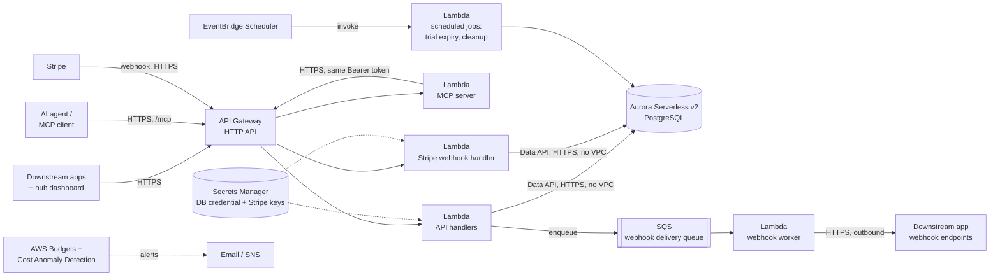

# Deployment Architecture

Where the platform API actually runs, and how it's billed. This is a deployment/operations document, not part of the [API specification](https://adron.github.io/substratalapps.com/) — it lives here, in the project root, rather than on the docs site, because a prospective API consumer (a developer, or their AI agent) never needs to know how this is hosted to build against it. See [README.md](README.md) for why the project draws that line here.

Chosen and configured around one constraint above all others: **predictable, capped cost, with no surprises.**

1. [Cost principles](#cost-principles)
2. [First deployment (Tier 0)](#first-deployment-tier-0)
3. [AWS account & region](#aws-account--region)
4. [Cost guardrails](#cost-guardrails)
5. [Growth trajectory](#growth-trajectory)
6. [Tenancy tiers & where they run](#tenancy-tiers--where-they-run)
7. [MCP server](#mcp-server)
8. [Stripe Billing](#stripe-billing)
9. [Audit log archival](#audit-log-archival)
10. [Scale-out](#scale-out)
11. [Build checklist](#build-checklist)
12. [Local development](#local-development)

---

## Cost principles

Four rules this architecture is built around, in priority order:

1. **No resource bills by the hour regardless of traffic.** No always-on EC2 instance, no Fargate task, no NAT Gateway. If nobody's calling the API, the API costs close to nothing.
2. **Every component with a cost has a known floor and a known ceiling.** "Serverless" isn't automatically cheaper — some AWS serverless products (Aurora Serverless v2's minimum capacity, for one) have a *higher* floor than the plain fixed-price alternative, and that trade is only worth it when something else about the product earns it back. See [Database engine: AWS options compared](#database-engine-aws-options-compared).
3. **A hard budget alarm exists before the first resource does.** Guardrails are step one of the build checklist below, not a follow-up task.
4. **Scale-out is a later, deliberate decision, not a default.** Nothing in Tier 0 auto-scales into real money without a human decision — see [Scale-out](#scale-out) for what actually triggers each upgrade.

## First deployment (Tier 0)



| Component | Service | Why this one |
|---|---|---|
| API compute | **Lambda** behind **API Gateway (HTTP API)** | Pay-per-request, zero idle cost. HTTP API over REST API — materially cheaper per request for the same job. |
| MCP compute | A **second, dedicated Lambda** behind the same **API Gateway**, at `/mcp` | Kept as its own function (not folded into the API handlers' Lambda) specifically so its concurrency, cold-start profile, and any future upgrade (see [MCP server](#mcp-server)) can be tuned independently without touching the REST path — same reasoning as the webhook worker already being split out below. |
| Stripe webhook compute | A **third, dedicated Lambda**, at `/internal/stripe/webhook` | Isolated from the API handlers' Lambda for the same reason the MCP Lambda is — plus a real security reason: it's the one route whose caller isn't an API-key/Bearer-token holder at all, verified instead by Stripe's own signature scheme (see [Stripe Billing](#stripe-billing)), so keeping it a separate function keeps that distinct trust boundary legible in the IAM/routing layer, not just in code. |
| Database | **Aurora Serverless v2 (PostgreSQL)**, accessed via the **RDS Data API** | The domain model is relational (joins, foreign keys, the Audit log) — Postgres fits it directly. Data API means Lambda calls the database over signed HTTPS with **no VPC attachment** — which is what avoids a NAT Gateway entirely (see below), not a minor detail. |
| Webhook delivery | **SQS** queue + a dedicated worker **Lambda** | Matches the retry/backoff schedule in the [Webhooks](https://adron.github.io/substratalapps.com/api-reference/webhooks/) spec — SQS visibility timeouts drive the delay between attempts for free, no extra scheduler needed for that part. |
| Scheduled jobs | **EventBridge Scheduler** → **Lambda** | Trial-expiry checks, idempotency-key cleanup — pay-per-invocation, no cron server to run. |
| Secrets | **Secrets Manager** — the Aurora master credential and the Stripe secret/webhook-signing keys | Everything else non-secret goes in Lambda environment variables rather than paying per-secret for config that isn't sensitive. |
| DNS / TLS | **Route 53** + **ACM** (free) + API Gateway custom domain | Backs the `api.substratalapps.com` base URL from the [API spec's Conventions](https://adron.github.io/substratalapps.com/api-reference/conventions/#base-url). |
| Static assets (avatars, etc.) | **S3** + **CloudFront** | Pay-per-use; negligible at Tier 0 volume. |
| Logs | **CloudWatch Logs**, retention capped at 30 days | Explicit retention is the fix for the single most common "why is my CloudWatch bill growing every month" surprise — logs left at *never expire* by default. |
| Cost guardrail | **AWS Budgets** (two thresholds) + **Cost Anomaly Detection** | See [Cost guardrails](#cost-guardrails) — this exists before the first Lambda does. |

### Database engine: AWS options compared

Postgres is the storage engine — the domain model is relational, and the schema depends on real foreign keys, `check` constraints, and Row-Level Security that a document store doesn't give for free. The question evaluated here is *which* AWS Postgres product, specifically for the lowest predictable starting price:

| Option | Starting price | Trade-off |
|---|---|---|
| **RDS for PostgreSQL**, single-AZ `db.t4g.micro` | ~$12–13/month, storage separate — the cheapest *fixed* number AWS offers | No Data API — Lambda needs a direct Postgres connection, which means VPC attachment, which reopens the NAT question this doc spent a whole section avoiding. Also no multi-cluster story: every tenancy tier would need its own bespoke connection-routing code, not just a lookup-table value. |
| **Aurora Provisioned (PostgreSQL-compatible)**, smallest instance | ~$55–60/month single-AZ — Aurora's smallest instance class is larger than RDS's smallest | Pricier than Serverless v2's floor for a low-traffic start, with none of Serverless v2's scale-with-load benefit. Not competitive against either other option at Tier 0 volume. |
| **Aurora Serverless v2 (PostgreSQL-compatible)**, 0.5 ACU minimum — **chosen** | ~$43/month floor, scales up with load | Costs more than bare RDS at idle. What it buys back: the **Data API**, which is why Tier 0 has no VPC at all (see [below](#why-no-vpc-and-specifically-no-nat-gateway)), and why [tenancy tiers](#tenancy-tiers--where-they-run) can route a request to any of several clusters — shared, or a specific customer's `isolated`/`dedicated_region` one — via one lookup-table value, with every tier using the identical connection mechanism. |

**The ~$30/month gap between RDS and Aurora Serverless v2 is a real, named cost** — not hand-waved away — paid specifically for not having to build and maintain two different database-connection code paths (one VPC-bound for a cheap shared tier, one Data-API-based for dedicated tenants) or a NAT Gateway. At Tier 0's actual scale (see [Growth trajectory](#growth-trajectory)) that $30/month is a smaller cost than the engineering time either alternative would take to build and keep correct.

### Why no VPC, and specifically no NAT Gateway

A NAT Gateway (~$32/month plus per-GB data processing, easy to forget it's running) is the single most common unexpected line item in a small AWS bill, and it's usually there because *something* in a VPC needed outbound internet access. This architecture avoids needing one at all:

- The API Lambda talks to Aurora via the **Data API** (HTTPS, IAM-signed) instead of a direct Postgres connection — so it never needs to be placed inside the VPC in the first place.
- The webhook-delivery worker needs genuine outbound internet access (POSTing to arbitrary downstream URLs) — it gets that for free by **not** being placed in a VPC either; a Lambda outside a VPC has normal internet access by default, at no extra cost.

Net effect: zero VPC, zero NAT, for the entire Tier 0 stack. This is revisited in [Scale-out](#scale-out) once throughput, not cost, becomes the binding constraint.

## AWS account & region

Resolved: a **dedicated AWS account**, in **`us-east-1`**.

**Dedicated account**, under an AWS Organization rather than reusing an existing personal/other-project account, specifically so [Cost guardrails](#cost-guardrails) below — the Budgets, the Cost Anomaly Detection baseline, the billing alarm — are scoped to exactly this system's spend from day one. A shared account makes every one of those guardrails a cost-allocation-tag exercise instead of an account-level default; at the current team size (one person plus an AI assistant, per the product's own stated growth plan) that's avoidable overhead, not a safety net worth the complexity. AWS Organizations (free) is still the right wrapper even for a single member account — it's what makes adding a second account (the [Scale-out](#scale-out) trigger for a separate staging environment) a few-minutes operation later instead of a migration.

**`us-east-1`**, over other candidates, for three concrete reasons rather than "it's the default":

- **Service availability.** New AWS features — including, historically, Aurora Serverless v2 capability updates — land in `us-east-1` first and most reliably. For a Tier 0 build that wants to stay current with the cheapest/newest options as they ship, that matters more than it would for a mature, stable workload.
- **Pricing.** `us-east-1` is at or near the lowest-cost tier for every service in the [Tier 0 component table](#first-deployment-tier-0) above (Lambda, Aurora Serverless v2, API Gateway, S3) — a handful of regions tie it, none meaningfully undercut it for this stack.
- **No data-residency constraint pulling the other way.** Nothing in the [Compliance](https://adron.github.io/substratalapps.com/compliance/) posture or the current customer base requires EU or other non-US placement for the *shared* tier specifically — that requirement, when it exists, is what the `dedicated_region` [tenancy tier](#tenancy-tiers--where-they-run) is *for*, scoped to the one customer who needs it rather than forcing a region choice for everyone.

This is a Tier 0 default, not a permanent commitment — nothing above prevents a `dedicated_region` Tenant from landing anywhere else, and nothing prevents revisiting the *shared* region later if a majority of the customer base ends up needing otherwise. Revisit if that happens; don't pre-build for it.

## Cost guardrails

Set up in this order, before any other resource:

1. **AWS Budgets** — two budgets on the account:
   - **Warn** budget: alerts at 50% / 80% / 100% of a modest monthly threshold (e.g. $75) — sized just above the known Tier 0 floor below, so it fires on real anomalies, not routine operation.
   - **Hard** budget: a [Budget Action](https://docs.aws.amazon.com/cost-management/latest/userguide/budgets-controls.html) at a second, higher threshold (e.g. $150) that automatically attaches a restrictive IAM policy to non-essential roles — a real circuit breaker, not just another email.
2. **AWS Cost Anomaly Detection** (free) — catches a spend spike from, say, a retry-loop bug days before a monthly Budget threshold would, specifically because it's pattern-based rather than threshold-based.
3. **CloudWatch billing alarm** as a third, independent tripwire — a single CloudWatch alarm on `EstimatedCharges` costs nothing and doesn't depend on either of the above working correctly.

### Illustrative Tier 0 floor cost

Rough, region-dependent, **not a quote**:

| Item | Approx. monthly floor |
|---|---|
| Aurora Serverless v2, 0.5 ACU minimum, running continuously | ~$43 |
| Aurora storage (low volume) | ~$1–5 |
| Secrets Manager (DB credential + Stripe keys, 2 secrets) | ~$0.80 |
| Route 53 hosted zone | ~$0.50 |
| Lambda + API Gateway + SQS + EventBridge at low traffic | Low single digits — much of this is covered by the AWS free tier for the first 12 months |
| S3 + CloudFront at low volume | Near $0 |
| MCP Lambda, Stripe webhook Lambda, low call volume each | Low single digits combined, same free-tier coverage as the API handlers' Lambda |
| **Floor total** | **~$45–55/month**, before any real traffic |

## Growth trajectory

The stated plan: dozens of users and a handful of Applications in the first 6–12 months, roughly 10x from there over the following 6–12 months, and another 10x (100x from today) beyond that.

| Horizon | Rough scale | What this means for the architecture |
|---|---|---|
| 0–6/12 months | Dozens of users, a few Applications | **Tier 0 as specified, unchanged.** The floor cost table above is sized for exactly this. |
| 6–12 months out (~10x) | Low hundreds of users | Watch rate-limit defaults and the Aurora ACU ceiling (not just the floor) — this is when the *first* [Scale-out](#scale-out) triggers are plausible, not guaranteed. Check real metrics rather than upgrading preemptively. |
| 12+ months (~100x) | Low thousands of users | The horizon [Scale-out](#scale-out)'s read-replica, Provisioned Concurrency, and RDS Proxy rows are realistically aimed at. Also the point multi-tenancy query performance under the Row-Level Security policies is worth profiling specifically, not just trusting by design. |

## Tenancy tiers & where they run

[Tenancy](https://adron.github.io/substratalapps.com/domain-model/tenancy/) is a second, independent scale-out axis — triggered by one customer's requirement, not by aggregate volume, and can happen on day one for a single large customer well before the traffic-driven triggers above are anywhere close.

| Tier | Infrastructure | Relationship to Tier 0 above |
|---|---|---|
| `shared` | Exactly [Tier 0](#first-deployment-tier-0) as specified — the same Aurora cluster every other `shared`-tier Tenant uses, isolated by the `tenant_id` Row-Level Security policy. | Is Tier 0. No separate infrastructure exists for this tier. |
| `isolated` | A second (third, fourth, …) Aurora Serverless v2 cluster, its own Secrets Manager secret, same AWS account and region as Tier 0. The API Lambda's Data API calls are routed to the right cluster via a small `tenants` lookup table kept in the primary/shared cluster — no new Lambda functions, no code fork. | One extra Aurora floor (~$45–55/month) per `isolated` Tenant — priced per [Pricing](https://adron.github.io/substratalapps.com/pricing/#enterprise-tenancy-tier-options). |
| `dedicated_region` | Like `isolated`, but the dedicated cluster — and, if latency to that region matters, a regional API Gateway + Lambda deployment in front of it — sits in the customer's chosen AWS region. | The `isolated` floor again, in a second region. |

### Migration mechanics

A tier change (`shared → isolated`, or either `→ dedicated_region`) is support-run, during a brief scheduled maintenance window:

1. Provision the destination cluster (new Aurora Serverless v2 cluster; for `dedicated_region`, in the target region) via the same [Build checklist](#build-checklist) steps used for Tier 0 itself.
2. Set the source Tenant's `status` to `migrating` — the API layer treats this as read-only for that Tenant's rows specifically, not a global outage.
3. Snapshot and restore (RDS snapshot copy, or `pg_dump`/`pg_restore` at this data volume) every row carrying that `tenant_id` into the destination cluster.
4. Update the `tenants` lookup row's cluster endpoint, flip `tier`/`region`/`status` back to `active`, decommission the old rows once the cutover is confirmed.
5. Record an Audit Event (`tenant.tier_changed`).

Because Entitlement, AppProfile, and AppSettings rows all denormalize `tenant_id`, step 3 is a `WHERE tenant_id = ...` export per table — no cross-table join needed to find everything that has to move.

## MCP server

See the [API spec's MCP Server page](https://adron.github.io/substratalapps.com/mcp-server/) for what this component is and why it exists; this section is the build-out and cost side of it specifically.

### Tier 0

A dedicated Lambda (shown in the [Tier 0 diagram](#first-deployment-tier-0) above as `MCP`), behind the same API Gateway, at a new `/mcp` route alongside the existing `/v1/*` routes — no new domain, no new certificate, no new hosted zone. On each MCP tool call, this Lambda:

1. Validates the `Mcp-Session-Id` (a signed, self-contained token) and decodes the JSON-RPC request.
2. Maps the requested tool name back to its `operationId` and calls the matching `/v1/...` route on the **same** API Gateway, forwarding the caller's own `Authorization` header unchanged.
3. Translates the REST response into the MCP result shape and returns a single, buffered JSON response.

This Lambda never talks to Aurora, Secrets Manager, or SQS directly — it only ever calls the existing API handlers over HTTPS, so its IAM execution role needs no data-plane permissions at all. It's the cheapest possible shape for this component: pure compute, pay-per-call, the same free-tier coverage as the main API handlers' Lambda.

### Scaling the MCP server

| Trigger | Change |
|---|---|
| Sustained high-frequency tool-call traffic on hot tools | Provisioned Concurrency on the MCP Lambda specifically — same pattern and trigger as the [Scale-out](#scale-out) table's cold-start row. |
| A real need for server-initiated push — mid-call progress notifications, or resumable streams | Move `/mcp` from a plain Lambda-behind-API-Gateway integration to a **Lambda Function URL with streaming responses enabled** (`InvokeMode: RESPONSE_STREAM`) — API Gateway's HTTP API integration buffers the full Lambda response, so it can't carry a chunked `text/event-stream`; a Function URL can. |
| Session/stream-resumption state that no longer fits in a short-lived signed token | A small **DynamoDB** table, keyed by session ID, TTL'd like `idempotency_keys` — ephemeral, high-churn, single-key lookup: the textbook case Aurora is the wrong tool for and DynamoDB is the right one. |
| More than a handful of concurrent agent integrations with genuinely different trust levels | Per-integration API Keys scoped as narrowly as each integration actually needs — an operational practice, not an infrastructure change. |

## Stripe Billing

[Pricing](https://adron.github.io/substratalapps.com/pricing/) specifies three subscription tiers; this is how they're actually charged, mechanically. Stripe Billing is the chosen processor — see [root DECISIONS.md #15](https://adron.github.io/substratalapps.com/decisions/#15-platform-subscription-billing-processor) for why, and note this is strictly about **Substratal's own platform subscription** (the Application-owner developer paying for Starter/Team/Enterprise), never about a developer's own end-user billing, which [stays entirely outside this API](https://adron.github.io/substratalapps.com/decisions/#4-billing-system-of-record).

### Objects and mapping

| Stripe object | Maps to |
|---|---|
| Stripe Customer | One per [Tenant](https://adron.github.io/substratalapps.com/domain-model/tenancy/) — created the moment a Tenant is created (at `shared`/`starter` defaults, a $0 subscription still gets a Customer record, so upgrading later never requires backfilling one). |
| Stripe Subscription | One per Tenant, holding its current `plan` (`starter`/`team`/`enterprise`) as the subscribed Price. A tier/plan upgrade is a Stripe subscription update, not a new subscription. |
| Stripe Price / Product | One Product per plan (Starter, Team, Enterprise), with metered/per-seat Prices attached for Team's and Enterprise's seat components — Stripe's native metered billing handles the "$6/seat beyond 25 included" shape directly rather than this API computing and reporting usage itself. |
| Stripe Invoice | Not mirrored into this API's own schema at all — Stripe remains the system of record for invoices/receipts; this API only needs to know current subscription *status*, not billing history. |

### `tenants` schema additions

```sql
alter table tenants
  add column stripe_customer_id text unique,
  add column stripe_subscription_id text unique,
  add column subscription_status text
    check (subscription_status in ('active','past_due','canceled','incomplete'));
```

`plan` (already on `tenants`, per the [Pricing](https://adron.github.io/substratalapps.com/pricing/) work) is the source of truth the rest of the API reads from; `subscription_status` is what the Stripe sync keeps current, and is what gates whether a `past_due`/`canceled` Tenant's `plan` enforcement (seat caps, Tenant tier availability) should be treated as still-active-on-good-faith or immediately restricted — a real product/business decision, not specified further here.

### Webhook handling

```
POST /internal/stripe/webhook
```

Not under `/v1` — same reasoning as the MCP server's `/mcp` route: this isn't a REST resource a caller invokes, it's an inbound event sink with its own, Stripe-defined contract and versioning. Not Bearer-authenticated either — verified via Stripe's own signature scheme (`Stripe-Signature` header, HMAC against the raw body and the webhook-signing secret from Secrets Manager), the same shape as this API's own outbound [webhook signature verification](https://adron.github.io/substratalapps.com/api-reference/webhooks/#verifying-the-signature) — deliberately symmetric with a pattern already specified, not a new one invented for this.

| Stripe event | Effect |
|---|---|
| `customer.subscription.created` / `.updated` | Sync `plan`, `subscription_status`, `stripe_subscription_id` onto the Tenant. A plan *downgrade* that would violate the `plan = 'enterprise' or tier = 'shared'` database constraint (e.g. an Enterprise customer on `isolated` downgrading to Team) is rejected at the application layer before it reaches Stripe — the UI/API surface that initiates a downgrade needs to check this first, not discover it as a constraint violation after the fact. |
| `customer.subscription.deleted` | `subscription_status = 'canceled'`; `plan` reverts to `starter` (never a hard account deletion — this is a billing-state transition, independent of the Tenant's and its Applications' own `status`). |
| `invoice.payment_failed` | `subscription_status = 'past_due'`. Does not immediately change `plan` or restrict access — Stripe's own retry schedule (Smart Retries) gets a chance first; only a subsequent `customer.subscription.deleted` (after Stripe's retries are exhausted) triggers the harder transition above. |

Idempotency: Stripe retries webhook delivery on a non-2xx response, the same way this API's own outbound webhooks do — dedupe on the Stripe event's own `id`, stored the same way the [idempotency_keys](https://adron.github.io/substratalapps.com/domain-model/database-schema/) table already works for this API's inbound writes, rather than inventing a second mechanism.

### Keeping this honest

**Stripe's official MCP server** is the recommended tool for building and testing this integration — ~25 tools covering customers, products, prices, subscriptions, invoices, and payment flows, so the webhook-handling logic above can be developed and verified against real Stripe test-mode objects from within an agentic coding session, rather than hand-rolling `curl` calls against Stripe's API or waiting for a real webhook to fire during development. Two ways to run it:

- **Hosted**, at `https://mcp.stripe.com` — OAuth per the MCP spec, or an API key as a Bearer token for clients that don't speak OAuth.
- **Local**, via `npx -y @stripe/mcp --api-key=<test-mode secret key>` — part of the `stripe/ai` toolkit monorepo, which also wires Stripe into agent frameworks (LangChain, the Vercel AI SDK, etc.) if that's ever needed beyond this API's own use.

Point it at Stripe **test mode** only, using a `sk_test_…` key, for exactly the reason [Conventions' test-vs-live API Keys](https://adron.github.io/substratalapps.com/api-reference/conventions/#authentication) already draws the same line on this API's own side.

## Audit log archival

[Non-Functional Requirements → Audit log lifecycle](https://adron.github.io/substratalapps.com/non-functional-requirements/#audit-log-lifecycle) specifies the hot/cold split that keeps "retained indefinitely" true without every [Pricing](https://adron.github.io/substratalapps.com/pricing/) tier paying for the same amount of fast storage. The mechanical side of that, on top of the [Tier 0](#first-deployment-tier-0) stack above:

| Step | Mechanism |
|---|---|
| Trigger | A daily **EventBridge Scheduler** rule, the same pattern already used for trial-expiry/idempotency-key cleanup — invokes a dedicated Lambda. |
| Select | Query `audit_events` for rows older than the owning Tenant's plan-tiered hot window (30 days / 1 year / negotiated — see [Pricing](https://adron.github.io/substratalapps.com/pricing/#enforcement)), batched by `tenant_id` using the existing `(tenant_id, timestamp desc)` index (see [Database Schema → audit_events](https://adron.github.io/substratalapps.com/domain-model/database-schema/#audit_events)). |
| Archive | Write the shape-only fields (`id`, `actor_user_id`, `action`, `target_user_id`, `application_id`, `tenant_id`, `timestamp`) — **never** `before`/`after` — as newline-delimited JSON to **S3**, under a lifecycle rule that transitions objects straight to **S3 Glacier Deep Archive** on arrival. This is the one-way redaction step: the snapshot values are dropped here, not carried into cold storage and redacted later. |
| Prune | Delete the archived rows from the hot `audit_events` table once the S3 write is confirmed — keeps Aurora storage cost bounded by the hot window, not by all-time event volume. |
| Retrieve | A Glacier Deep Archive restore job (support-initiated, ~12-hour retrieval SLA) for the rare dispute/investigation that needs an archived event's shape — there is no live API path to cold storage, deliberately; see [Non-Functional Requirements → Audit log lifecycle](https://adron.github.io/substratalapps.com/non-functional-requirements/#audit-log-lifecycle). |

Cost is negligible at Tier 0 volume (Glacier Deep Archive is priced for exactly this shape of rarely-read, kept-forever data) — this is about bounding Aurora's hot-table size and honoring the redaction-on-age guarantee, not about saving money on S3 itself.

## Scale-out

Nothing below is pre-built into Tier 0 — each is a deliberate upgrade, triggered by a specific, named condition, not a default growth path.

| Trigger | Change |
|---|---|
| Sustained read load on `effective-permissions` / catalog reads | Add an Aurora read replica; consider API Gateway response caching for read-heavy, low-churn paths. |
| Lambda cold-start latency becomes user-visible on hot paths | Provisioned Concurrency on the `effective-permissions` and entitlement-toggle handlers specifically — not a blanket setting. |
| Sustained high-throughput DB access, where Data API's per-call overhead starts to matter | Move those paths from Data API to direct VPC connections through **RDS Proxy** — this is the point where a NAT Gateway (or a cheaper NAT instance) becomes worth its cost, because throughput now justifies it rather than convenience. |
| Geographically distributed callers, latency-sensitive | CloudFront in front of API Gateway. |
| Hub availability becomes a real incident risk for every downstream app, not a theoretical one | Multi-region active-passive — deliberately not a Tier 0/1 concern; premature multi-region is itself a cost and complexity risk. |
| Webhook delivery volume grows enough to need isolation from the main API's blast radius | Split the worker Lambda's concurrency/alerting from the API handlers' (it already runs as a separate function). |
| More than one engineer shipping concurrently | A second AWS account (via AWS Organizations) for staging, separate from production — Tier 0 runs on a single account with a `dev`/`prod` naming convention, which is enough until this trigger. |
| A specific customer requires dedicated or regional infrastructure | Run the [Tenancy tiers](#tenancy-tiers--where-they-run) migration for that one customer's Tenant — the one scale-out trigger in this table that's customer-specific rather than aggregate-volume-driven. |
| Agent/MCP tool-call traffic needs server-push, resumable streams, or dedicated concurrency | See [MCP server → Scaling the MCP server](#scaling-the-mcp-server) — its own trigger table. |
| Stripe billing volume or complexity outgrows a single webhook Lambda (e.g. real invoice-dunning logic, usage-based billing beyond simple per-seat metering) | Revisit as its own build, not folded into this table speculatively — nothing here is blocked on it. |

## Build checklist

The order this gets stood up in, once API implementation begins:

1. AWS account (dedicated member account under Organizations, `us-east-1` — see [AWS account & region](#aws-account--region)) + billing contact + **Budgets and Cost Anomaly Detection from step 1**, before any other resource.
2. Route 53 hosted zone + ACM certificate for the chosen API domain.
3. Secrets Manager secrets: the Aurora master credential, and Stripe's secret key + webhook-signing secret (test-mode keys first — see [Stripe Billing](#stripe-billing)). Aurora Serverless v2 cluster with Data API enabled, minimum 0.5 / maximum capacity set deliberately.
4. IAM: one execution role per Lambda function (API handlers, MCP server, Stripe webhook handler, webhook worker, scheduled-jobs), each scoped to only the resources it actually needs — no shared mega-role.
5. API Gateway HTTP API + custom domain mapping; Lambda handlers deployed behind it, implementing the [API Reference](https://adron.github.io/substratalapps.com/api-reference/) / [openapi.yaml](https://adron.github.io/substratalapps.com/openapi.yaml) contract.
6. SQS queue + webhook worker Lambda; EventBridge Scheduler rules for trial expiry, idempotency-key cleanup, and [audit log archival](#audit-log-archival).
7. Stripe account + Products/Prices for Starter/Team/Enterprise (test mode first); `/internal/stripe/webhook` route and handler.
8. CloudWatch Logs with explicit retention on every log group; a small set of alarms (error rate, Lambda throttling, Aurora ACU near max) in addition to the billing guardrails from step 1.
9. CI/CD via OIDC federation (GitHub Actions → an AWS deploy role) — no long-lived IAM user access keys committed anywhere.

## Local development

The RDS Data API choice that keeps Tier 0 NAT-free has a real cost: it doesn't have a clean open-source local emulator, so a developer can't just point the production data-access code at "Data API, but local" the way they could with a plain Postgres driver.

The fix is to not let that choice leak into the application code in the first place: put all database access behind a small repository/data-access interface, with two implementations — one using the Data API (what Lambda runs in every real environment), one using a direct Postgres driver against a local `docker-compose` Postgres (what runs on a laptop and in CI). Business logic and request handlers talk to the interface and never know which implementation is underneath.

Stripe's own test mode (plus the Stripe MCP server referenced in [Stripe Billing](#stripe-billing)) covers the equivalent problem on the billing side — no local Stripe emulator is needed, since Stripe's hosted test mode is free and already the standard way to develop against it.
