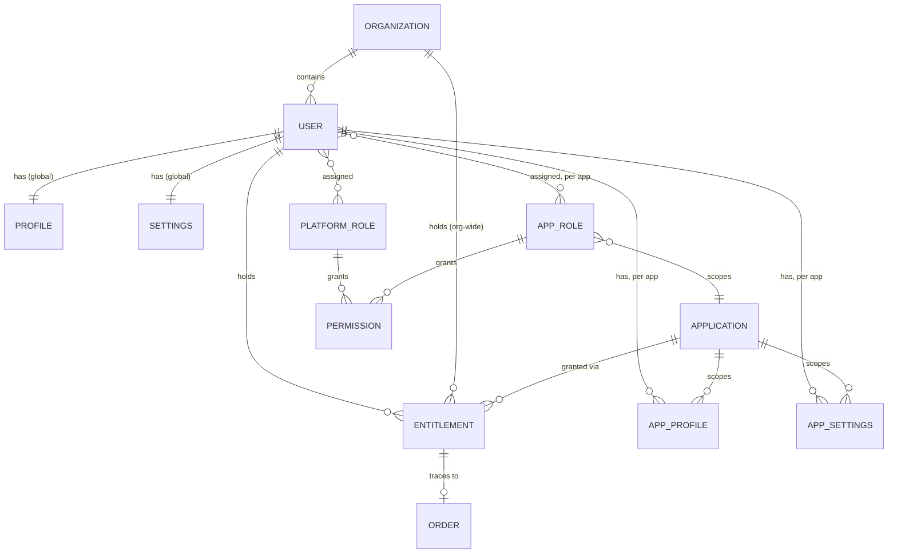
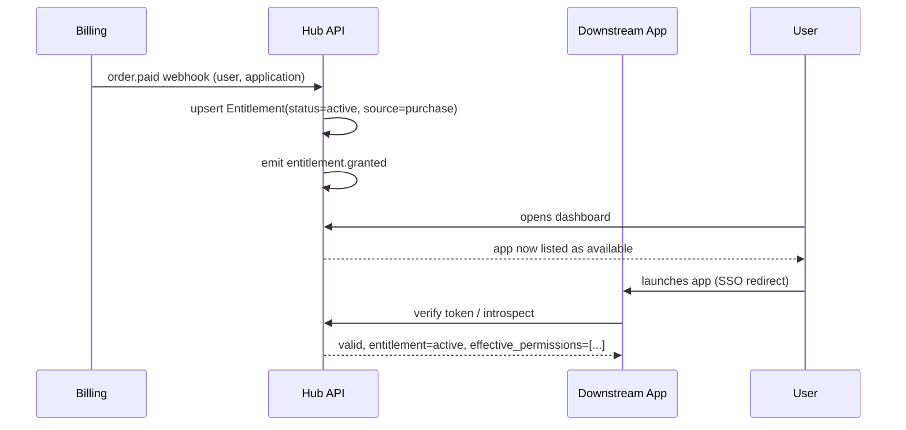

> **Superseded.** This is the original single-document draft the full specification at [adron.github.io/substratalapps.com](https://adron.github.io/substratalapps.com/) was elaborated from — kept here for history, in the project root rather than the docs site, specifically so it's never mistaken for current spec. It contradicts current decisions in several structural ways (no [Tenant](https://adron.github.io/substratalapps.com/domain-model/tenancy/) concept, single-method auth, a 3-question access algorithm instead of the current 2-axis union model) — if anything below conflicts with the live docs site or [`decisions.md`](https://adron.github.io/substratalapps.com/decisions/), the live site wins, always. See [README.md](README.md) and the [Changelog](https://adron.github.io/substratalapps.com/changelog/#2026-10-03)'s initial-publication entry for how this became that.

# Substratal Hub — Access & Identity API

**Status:** Draft for elaboration · **Scope:** platform API that sits behind substratalapps.com · **Audience:** engineers turning this into a full technical spec

## 1. What this document is

Substratal Apps is the hub a customer lands on to see every app, product, and service they've purchased from Substratal, sign into it with one identity, and manage their account across all of them. This document describes the API that powers that hub: the system of record for *who* a user is, *what* they're allowed to touch, and *how* each app they own is configured for them.

It is deliberately a level above endpoint-by-endpoint detail. The goal is a domain model and resource map solid enough that a full OpenAPI spec, data schema, and build plan can be written from it without re-litigating the core decisions. Section 13 lists the decisions this draft deferred — resolve those before the full spec is final.

**In scope:** user identity, roles & permissions, per-app entitlement (the purchase → access → on/off lifecycle), per-user profile data (global and per-app), per-user settings (global and per-app), the events/tokens downstream apps need to trust the hub.

**Out of scope (adjacent systems this API talks to, but doesn't replace):** payment processing, app-specific business logic/data, marketing site content, support ticketing.

## 2. Domain model

| Entity | What it represents |
|---|---|
| **User** | A person with an account on Substratal. One identity, used everywhere. |
| **Organization** *(optional — see §13)* | A billing/access group of Users, e.g. a team plan. If absent, every User is implicitly its own org of one. |
| **Application** | A catalog entry for a product/service Substratal sells — "Product," not "running process." The app a user ultimately gets routed to. |
| **Role** | A named bundle of Permissions. Scoped either to the whole platform (`PlatformRole`) or to one Application (`AppRole`). |
| **Permission** | An atomic, checkable capability (`billing.manage`, `app.timetrack.export`, …). |
| **Entitlement** | The join between a User (or Org) and an Application: *do they own it, and is it currently switched on.* This is the record behind "turn an app on/off for a user." |
| **Profile** | Display/contact identity data. Global (name, avatar, email, locale) and, separately, per-app (fields only that app cares about — e.g. a display handle used only inside one product). |
| **Setting** | Configuration, not identity. Global (site-wide preferences) and per-app (that app's preferences for that user), each layered over an app-level default. |
| **Order / Subscription** | The commerce record (what was bought, when, recurring or not) that an Entitlement traces back to. Owned by billing, referenced here. |
| **Audit Event** | An immutable record of who changed what access, when. |

### 2.1 Entity relationships



The two relationships worth pausing on: an **Entitlement** is independent of a **Role**. Entitlement answers "can this user reach App X at all, right now" (the on/off switch). Role answers "once inside, what can they do." A support agent can hold a platform Role that lets them *see* every user's entitlements without ever holding an entitlement to a single app themselves — access-to-manage-access is a different axis from access-to-use.

## 3. Access control model

Three independent questions, in the order they get checked:

1. **Is the app itself live for this user?** → `Entitlement.status == active` for (User, Application). If no, stop — nothing below matters. This is the literal on/off toggle an admin or billing event flips.
2. **Does the user hold a Role — platform or app-scoped — that grants the Permission being invoked?** → union of `PlatformRole` permissions and, for that Application, `AppRole` permissions.
3. **Org-level override, if Organizations are in play** → an Org admin's Role can widen or narrow what members of that org inherit by default.

```
allow(user, application, permission) :=
    entitlement(user, application).status == "active"
    AND permission ∈ effective_permissions(user, application)
```

`effective_permissions` is the union of permissions from every `PlatformRole` assigned to the user, plus every `AppRole` assigned to the user scoped to that `application`.

**Platform roles** (examples): `superadmin`, `support`, `billing_admin`, `member`. These govern the hub itself — managing other users, issuing refunds, viewing audit logs.

**App roles** are defined per Application by whoever owns that app's catalog entry (e.g. an app might define `admin` / `editor` / `viewer`), but the hub is the registry and the enforcement point for them — a downstream app doesn't maintain its own user table, it asks the hub.

## 4. Resource & data model

### 4.1 User
| Field | Notes |
|---|---|
| `id` | opaque, stable |
| `email` | unique, verified flag |
| `status` | `active` \| `invited` \| `suspended` \| `deleted` |
| `auth` | password hash / SSO subject, MFA state — likely delegated to an identity provider rather than owned here (see §13) |
| `created_at`, `last_login_at` | |
| `organization_id` | nullable |

### 4.2 Profile (global) & AppProfile
| Field | Global `Profile` | `AppProfile` (per User × Application) |
|---|---|---|
| name, avatar_url | ✓ | — (inherits unless overridden) |
| display_handle | — | ✓ app-local identity, e.g. a username only meaningful inside one product |
| contact email/phone | ✓ | — |
| custom fields | — | ✓ arbitrary JSON the owning app defines for itself |

### 4.3 Settings (global) & AppSettings
| Field | Global `Settings` | `AppSettings` (per User × Application) |
|---|---|---|
| locale, timezone, theme | ✓ | inherits from global unless set |
| notification preferences | ✓ (site-wide) | ✓ (per-app channel overrides) |
| app-specific preferences | — | ✓ arbitrary JSON, validated against that app's declared settings schema |

Resolution order for any setting an app reads: **AppSettings → Settings → Application's declared default.** The hub stores the override layers; it does not need to know what each key means, only enforce the schema the Application registered for itself.

### 4.4 Application (catalog entry)
| Field | Notes |
|---|---|
| `id`, `slug`, `name`, `description`, `icon_url` | catalog/display |
| `launch_url` / `sso_redirect` | where the hub sends an authenticated user |
| `settings_schema` | JSON Schema the app declares, so AppSettings can be validated centrally |
| `available_app_roles` | roles this app defines, for role-assignment UI |
| `visibility` | `public` (anyone can acquire) \| `invite_only` \| `internal` |

### 4.5 Entitlement
| Field | Notes |
|---|---|
| `id`, `user_id` (or `organization_id`), `application_id` | |
| `status` | `active` \| `disabled` \| `expired` \| `revoked` |
| `source` | `purchase` \| `trial` \| `admin_grant` \| `org_seat` |
| `order_id` | nullable link to commerce record |
| `starts_at`, `ends_at` | for trials/subscriptions |
| `disabled_reason` | free text / enum, set when an admin flips it off manually |

### 4.6 Role / Permission
| Field | Notes |
|---|---|
| `Role.id`, `name`, `scope` | `scope` = `platform` or `application_id` |
| `Role.permissions[]` | list of Permission keys |
| `Permission.key` | dotted string, e.g. `users.manage`, `app.<slug>.export` |
| `UserRoleAssignment` | (`user_id`, `role_id`, nullable `application_id` for app-scoped roles) |

### 4.7 Order / Subscription (referenced, owned by billing)
Minimal fields the access API needs to react to: `id`, `user_id`/`organization_id`, `application_id`(s), `status` (`paid`, `past_due`, `cancelled`, `refunded`), `renews_at`. A billing webhook updates Entitlement status off of these — this API doesn't process payment.

### 4.8 Audit Event
`id`, `actor_user_id`, `action` (`entitlement.disabled`, `role.assigned`, …), `target_user_id`, `application_id` (nullable), `before`/`after` snapshot, `timestamp`.

## 5. API surface

Resource-oriented REST, versioned (`/v1`), JSON, cursor pagination on list endpoints, idempotency keys on mutating ones.

| Group | Endpoints | Purpose |
|---|---|---|
| **Auth** | `POST /v1/auth/login`, `POST /v1/auth/token/refresh`, `POST /v1/auth/sso/{provider}/callback`, `POST /v1/auth/logout` | Issue/refresh the session; see §7 for what downstream apps do with the result. |
| **Users** | `GET/POST /v1/users`, `GET/PATCH/DELETE /v1/users/{id}`, `POST /v1/users/{id}/suspend` | Account lifecycle. |
| **Profile** | `GET/PATCH /v1/users/{id}/profile`, `GET/PATCH /v1/users/{id}/apps/{appId}/profile` | Global vs. per-app profile. |
| **Settings** | `GET/PATCH /v1/users/{id}/settings`, `GET/PATCH /v1/users/{id}/apps/{appId}/settings` | Global vs. per-app settings, validated against the app's schema. |
| **Applications (catalog)** | `GET /v1/applications`, `GET/POST/PATCH /v1/applications/{id}` (admin-only write) | The app catalog shown on the hub. |
| **Entitlements** | `GET /v1/users/{id}/entitlements`, `POST /v1/users/{id}/entitlements`, `PATCH /v1/entitlements/{id}` (`{status: "disabled"}` is the on/off switch), `DELETE /v1/entitlements/{id}` | Grant, list, toggle, revoke access to an app. |
| **Roles** | `GET/POST /v1/roles`, `GET /v1/users/{id}/roles`, `POST/DELETE /v1/users/{id}/roles/{roleId}` | Assign/remove platform or app roles. |
| **Permissions** | `GET /v1/permissions`, `GET /v1/users/{id}/applications/{appId}/effective-permissions` | The resolved-permission check downstream apps and UI call. |
| **Organizations** *(if in scope)* | `GET/POST /v1/organizations`, `.../members`, `.../entitlements` | Team/seat management. |
| **Audit** | `GET /v1/audit-events` (filterable by user/app/actor) | Compliance and support investigation. |
| **Webhooks** | `GET/POST /v1/webhooks` (subscription management) | See §6. |

## 6. Key workflows

**Purchase → access.** Billing completes an Order → billing service calls (or the hub listens for) a webhook → hub creates/updates an `Entitlement(status=active, source=purchase, order_id=...)` → hub emits `entitlement.granted` → the hub UI now shows the app as available, and the downstream app (if it independently checks) sees it on next token refresh or introspection call.



**Admin turns an app off for a user.** Support/admin calls `PATCH /entitlements/{id} {status: disabled, disabled_reason}` → hub writes an Audit Event → emits `entitlement.revoked` → any live session the user has in that app is invalidated on next check (the app should re-verify on a short interval, not just at login — see §7).

**Role change.** Admin assigns/removes a Role → `effective-permissions` for that user+app changes immediately → downstream app picks it up the next time it checks (introspection or next token refresh), not necessarily mid-session unless the app subscribes to the webhook.

## 7. How downstream apps trust the hub

Each Application is a largely independent product; it shouldn't maintain its own user table. Two mechanisms, meant to be used together:

- **Short-lived JWT**, issued at login/SSO-redirect, carrying `sub` (user id), `org_id`, and claims for *that specific app* (`entitlement_status`, `roles`, `effective_permissions`), signed by the hub. Cheap to verify locally, but can go stale within its TTL — keep the TTL short (minutes) for anything access-sensitive.
- **Introspection endpoint** (`GET /v1/users/{id}/applications/{appId}/effective-permissions`) for anything that needs a live answer — e.g. before a destructive action, or to immediately honor an admin's "turn this off" click rather than waiting out a token TTL.
- **Webhooks** (`entitlement.granted`, `entitlement.revoked`, `role.assigned`, `role.removed`) for apps that want to react immediately (kill an active session) rather than poll.

## 8. Non-functional requirements

- **AuthN:** OAuth2/OIDC for user-facing login (own IdP or delegate to one — see §13); service-to-service calls (billing → hub, app → hub) use scoped API keys or mTLS.
- **AuthZ enforcement point:** the hub is the only writer of Role/Entitlement state. Apps read, they don't maintain parallel copies.
- **Multi-tenancy:** every record scoped by `organization_id` where orgs are in play; row-level isolation, not just application-level filtering.
- **Audit:** every write to Entitlement, Role assignment, or admin-initiated Profile/Settings change is logged immutably.
- **Rate limiting & idempotency:** standard on all mutating endpoints; idempotency key required on Entitlement and Order-triggered writes since billing webhooks retry.
- **Versioning:** `/v1` now; additive changes preferred over breaking ones; deprecation window policy to be set in the full spec.

## 9. Phased build

| Phase | Delivers |
|---|---|
| **MVP** | User, Profile (global only), Application catalog, Entitlement (grant/revoke/toggle), Platform Roles only, basic audit log. Enough for "see my apps, click to launch, admin can turn access on/off." |
| **Phase 2** | App-scoped Roles & Permissions, per-app Profile and Settings with schema validation, webhooks, introspection endpoint. |
| **Phase 3** | Organizations/seats, delegated admin (org admin manages their own members), richer audit/compliance views, SCIM-style provisioning for larger customers. |

## 10. Open decisions (resolve before writing the full spec)

1. **Identity provider:** build auth in-house, or delegate to an IdP (Auth0, Clerk, WorkOS, Cognito, …)? Changes what §4.1/`auth` and §7's JWT issuance actually look like.
2. **Organizations:** is multi-seat/team access a day-one requirement, or does every account start as a single user and orgs get bolted on later? Affects whether `organization_id` is load-bearing now or added in Phase 3.
3. **Downstream app architecture:** are the "apps" separately hosted services that need SSO + token verification (as assumed above), or more like modules/iframes inside one deployment, where access control could live entirely in the hub's own session? This is the single biggest fork in the API shape.
4. **Billing system of record:** which processor, and does it push webhooks to the hub or does the hub poll it? Determines the contract in §2's Order entity and §6's purchase workflow.
5. **Settings schema ownership:** does each Application register its own JSON Schema with the hub (as assumed in §4.3), or does the hub stay fully opaque to app settings and just store/return a blob?
6. **Session model for revocation:** how fast must "turn off this user's access" take effect inside an already-open app session — immediately (requires apps to poll/subscribe) or "by next login" (much simpler, weaker guarantee)?
