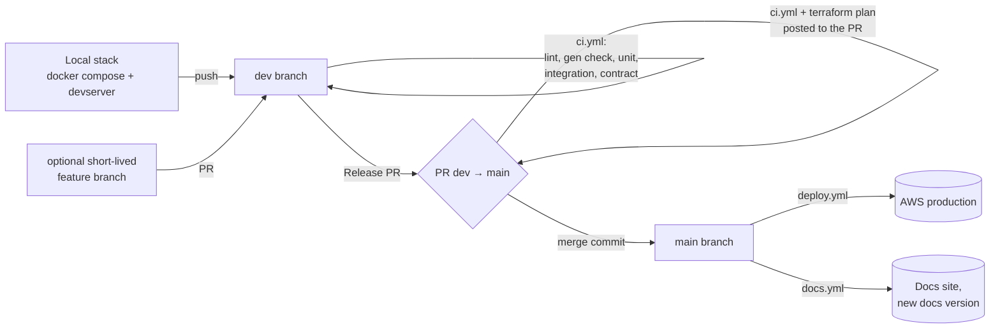

# Substratal Apps

The user/organization/tenancy/settings/storage API layer an app developer would otherwise have to build themselves — comparable in shape to Auth0, Clerk, or WorkOS, scoped around everything a multi-tenant app needs: accounts, roles and permissions, per-app settings, team/tenancy structure, and per-user storage, all behind one API. When your business is building applications — on iOS, macOS, Windows, Linux, or the web — Substratal Apps removes the user-management burden so you can focus on the application itself.

**Full API specification: [adron.github.io/substratalapps.com](https://adron.github.io/substratalapps.com/)**

## Where things are

This repository is split deliberately, by audience:

| Audience | Lives | Why |
|---|---|---|
| **An API consumer** — a developer building an Application on this platform, or their AI coding agent | [`docs/`](docs/), published at [adron.github.io/substratalapps.com](https://adron.github.io/substratalapps.com/) | The API specification, and nothing else: domain model, access control, every endpoint and schema, workflows, the MCP server for agent callers, pricing. Everything a consumer needs to build *against* this API. |
| **Whoever is building *this* API** | The project root (this file and its siblings) | Deployment/infrastructure, the implementation build order, and the internal decision log aren't things a consumer needs to use the API — they're how it gets built and run. Kept separate so the docs site stays focused, per its own [Home page](https://adron.github.io/substratalapps.com/#what-this-site-is). |

Root-level documents:

- **[PLAN.md](PLAN.md)** — the build order: what to implement first, which spec page governs each piece, phase-by-phase exit criteria.
- **[DECISIONS.md](DECISIONS.md)** — questions awaiting a product or business decision, and an index of where each resolved decision now lives in the spec. Resolved answers are written into the spec pages themselves, not kept here.
- **[DEPLOYMENT.md](DEPLOYMENT.md)** — AWS infrastructure (cost-capped, Aurora Serverless v2, Lambda, no VPC/NAT at Tier 0), Stripe Billing implementation, the MCP servers recommended for building against AWS/Postgres/Stripe, and the scale-out triggers for when any of this needs to change.
- **[LICENSE](LICENSE)** — MIT.
- **[ORIGINAL-SPEC-DRAFT.md](ORIGINAL-SPEC-DRAFT.md)** — the original single-document draft this whole spec was elaborated from. Kept for history, moved here (out of `docs/`) specifically so it can't be mistaken for current spec — it contradicts several later decisions.

Not yet moved to the root, but should be, by the same reasoning above — tracked so this doesn't get silently forgotten:

- `docs/roadmap.md` — feature phasing (MVP/Phase 2/Phase 3). Same reasoning, smaller blast radius (~8 files).
- `docs/domain-model/database-schema.md` — Postgres implementation detail (types, constraints, indexes), explicitly written for an implementer rather than an API caller. Same reasoning.

Deliberately **staying** on the docs site despite being borderline: `compliance.md` (a prospective developer's own compliance due-diligence is part of evaluating whether to build on this platform) and `changelog.md` (standard practice for an API's own consumers to track what changed). Revisit either if that judgment turns out wrong.

## Status

**Specification-complete for an MVP build; implementation has not started.** The stack is decided (Go on Lambda, Terraform; see [Technology stack](#technology-stack)), and day-to-day work happens on the `dev` branch (see [Branches, CI, and deployment](#branches-ci-and-deployment)). The API described at [adron.github.io/substratalapps.com](https://adron.github.io/substratalapps.com/) is a target contract, not a running service — there is no code in this repository yet beyond the documentation site itself and this planning layer. See [PLAN.md](PLAN.md) for the build order and [DECISIONS.md](DECISIONS.md) for questions still awaiting a decision. Decisions #1–#30 are resolved and written into the spec pages they govern; the only open question (#31, final prices and billing options) doesn't block the build. Check `DECISIONS.md` before starting a phase, since real implementation can surface a new question nobody asked yet.

## Technology stack

Decided 2026-10-06. The API is written in **Go**, deployed to **AWS Lambda**, and its infrastructure is defined in **Terraform**.

| Layer | Choice | Why |
|---|---|---|
| Language | **Go** (latest stable release, pinned in `go.mod`) | Cold starts in the tens of milliseconds and small memory use on Lambda. That directly serves the p95 < 150 ms target for `effective-permissions`, `app-tokens`, and `oauth/token` in [Non-Functional Requirements](https://adron.github.io/substratalapps.com/non-functional-requirements/), and the cost-first rules in [DEPLOYMENT.md](DEPLOYMENT.md#cost-principles). Strongly typed, stable for years, and plain enough that a one-person team and an AI assistant can both read and change it safely. |
| Lambda runtime | `provided.al2023` on **arm64** (Graviton) | Go compiles to one static `bootstrap` binary. arm64 is cheaper per GB-second than x86 for the same work. |
| HTTP layer | Standard library `net/http`, with server interfaces and types **generated from [`docs/openapi.yaml`](docs/openapi.yaml)** by `oapi-codegen` (strict server mode) | The spec is the contract. Generating from it means an endpoint whose shape doesn't match `openapi.yaml` fails to compile, and contract tests catch the runtime side. |
| Lambda adapter | `aws-lambda-go`, plus a thin adapter that turns API Gateway HTTP API events into `http.Request`s | The **same** `http.Handler` serves requests on a laptop and in Lambda. Nothing in handler code knows which one it's running in. |
| Database | **PostgreSQL 16**. In AWS: Aurora Serverless v2 through the **RDS Data API**. Locally and in CI: plain Postgres through **`pgx`**. | Both sit behind one repository interface, as [DEPLOYMENT.md → Local development](DEPLOYMENT.md#local-development) requires. See [The two database backends](#the-two-database-backends). |
| Migrations | Plain, numbered SQL files in `migrations/`, applied by an in-repo `cmd/migrate` tool | Same tool, same files, same tracking table (`schema_migrations`) in every environment. An in-repo runner is used instead of a third-party tool because the common Go migration tools need a `database/sql` driver, and the Data API has no first-party one. |
| Crypto | `golang.org/x/crypto/argon2` (Argon2id), standard-library HMAC/RSA, AWS KMS for JWT signing and secret encryption | Matches [Non-Functional Requirements → Security](https://adron.github.io/substratalapps.com/non-functional-requirements/) exactly, with no native add-ons. |
| AWS access | AWS SDK for Go v2 (Data API, KMS, SQS, Secrets Manager, S3, SES) | |
| Billing | `stripe-go`, Stripe's official Go library | |
| MCP server | Go, using the official MCP Go SDK | Per [DEPLOYMENT.md → MCP server](DEPLOYMENT.md#mcp-server), it only proxies HTTPS calls to `/v1`, so it needs no special language features. |
| Infrastructure | **Terraform**, remote state in S3 (native S3 state locking, no DynamoDB table) | Language-neutral and widely known, and `terraform plan` output can be reviewed on the pull request before it reaches production. Works with OpenTofu too. |
| CI/CD | **GitHub Actions**, deploying to AWS through **OIDC federation** | No long-lived AWS keys anywhere, per [DEPLOYMENT.md → Build checklist](DEPLOYMENT.md#build-checklist) step 9. |
| Local services | **Docker Compose**: Postgres 16, LocalStack (SQS, KMS, Secrets Manager, S3), Mailpit (captures outgoing email) | The whole API runs on a laptop with no AWS account and no internet beyond Stripe test mode. |

Considered and not chosen: **TypeScript on Node.js** (fastest early development and the most mature MCP SDK, but slower cold starts, types that disappear at runtime, and more dependency churn over a long-lived project), and **Java** (mature, and SnapStart fixes cold starts, but heavier memory use and more framework machinery than Tier 0's small per-request Lambdas and a one-person team need). Revisit only if the deployment model changes, for example a move from Lambda to long-running containers.

### Repository layout

The API code lives in this same repository, next to the docs. That matters: a change to the API contract (`docs/openapi.yaml`), the code that implements it, and the docs that describe it all land in **one pull request** and ship in **one merge**. Planned layout:

```text
.
├── cmd/                      # One main package per Lambda function, each with its own IAM role
│   ├── api/                  #   REST handlers for /v1/*
│   ├── mcp/                  #   MCP server at /mcp
│   ├── stripe-webhook/       #   /internal/stripe/webhook
│   ├── webhook-worker/       #   SQS consumer that delivers outbound webhooks
│   ├── jobs/                 #   EventBridge-scheduled jobs (expiry sweep, cleanup, archival…)
│   ├── migrate/              #   Schema migration runner (pgx or Data API backend)
│   └── devserver/            #   Local only: every route above on one port, plus in-process workers
├── internal/
│   ├── api/gen/              # Generated from docs/openapi.yaml. Never edited by hand.
│   ├── handlers/             # Implements the generated strict-server interface
│   ├── access/               # allow(user, application, permission): the Access Control algorithm
│   ├── store/                # Repository interfaces, one per aggregate
│   │   ├── pg/               #   pgx implementation (local, CI)
│   │   └── dataapi/          #   RDS Data API implementation (AWS)
│   ├── auth/  crypto/  billing/  webhooks/  email/  audit/
│   └── platform/             # Config, logging, Lambda adapter, AWS clients
├── migrations/               # 0001_init.sql, 0002_….sql: plain SQL, forward-only
├── seeds/                    # Local and test data, built from the API Reference examples
├── infra/terraform/
│   ├── bootstrap/            # Applied once, by hand: state bucket, OIDC provider, deploy roles
│   ├── modules/              # lambda_function, http_api, aurora, queues, budgets, …
│   └── prod/                 # The production environment
├── docker-compose.yml
├── Makefile
├── .env.example
├── docs/                     # The API spec site (unchanged)
└── .github/workflows/
    ├── ci.yml                # Every push to dev and every PR into main
    ├── deploy.yml            # Every merge into main → production
    └── docs.yml              # Docs versioning and Pages (already in place)
```

## Branches, CI, and deployment

The intent, in one line: **all work happens on `dev`; `main` is production; merging `dev` into `main` is the release, and it deploys automatically and only that way.**



### The branches

| Branch | What it is | Who writes to it |
|---|---|---|
| **`dev`** | The integration branch. Where all day-to-day work lands, and what your local checkout tracks. Always expected to pass CI, but never deployed anywhere. | You, directly or through short-lived feature branches merged into it. |
| **`main`** | **Production.** Every commit on `main` is either deployed or being deployed. The docs site is built from it too. | Only pull requests from `dev` (releases) or from a `hotfix/*` branch. Never a direct push. |
| `feature/*` (optional) | A short-lived branch off `dev` for anything you want CI to check in isolation before it reaches `dev`. | You. Deleted after merging into `dev`. |
| `hotfix/*` | An urgent production fix, branched off `main`. | You. See [Hotfixes](#hotfixes). |
| `docs-versions` | Archived docs snapshots. CI-owned. See [Docs versions and publishing](#docs-versions-and-publishing). | Only the docs workflow. |

### What runs on `dev`: `ci.yml`

Every push to `dev` (and to `feature/*`), and every pull request into `main`, runs the same checks. Nothing here touches AWS.

1. **Format and lint.** `gofmt` check, `go vet`, `golangci-lint`. `terraform fmt -check`, `terraform validate`, `tflint`.
2. **Generated code is current.** Re-runs `oapi-codegen` against `docs/openapi.yaml` and fails if the result differs from what's committed in `internal/api/gen/`. Editing the spec without regenerating, or editing generated code by hand, can't reach `main`.
3. **Unit tests**, including exhaustive tests of the Access Control resolution logic (every combination of entitlement status × platform role × app role), per [Testing strategy](https://adron.github.io/substratalapps.com/non-functional-requirements/#testing-strategy).
4. **Integration tests** against real Postgres 16 and LocalStack running as GitHub Actions service containers, with every migration applied from zero. These run the pgx backend, including the Row-Level Security policies, which a mocked data layer would let pass while broken.
5. **Contract tests.** The devserver starts, and every response is validated against `docs/openapi.yaml`.
6. **Quickstart test.** The [Quickstart](https://adron.github.io/substratalapps.com/quickstart/) walkthrough runs as a script against the devserver. It's the Phase 1 acceptance test from [PLAN.md](PLAN.md#phase-1--mvp), so it runs on every change, not just at milestones.
7. **Build.** Every `cmd/*` function compiles for `linux/arm64` (`CGO_ENABLED=0`, `-tags lambda.norpc`) and is zipped as `bootstrap`, which proves the release artifacts can be built.
8. **Docs build.** `jekyll build` of `docs/`, so a broken docs page is caught on `dev`, not on the release.

On a pull request into `main` only, one more step runs:

9. **`terraform plan` against production**, using a **read-only** plan role through OIDC. The plan is posted as a PR comment. This is the one thing to read carefully before merging a release: it is exactly what the merge will change in AWS.

There is deliberately **no deployed dev environment** at Tier 0. A second copy of the stack would roughly double the Aurora floor cost (~$43/month), and the local stack covers what it would be used for. Adding one, ideally in a separate AWS account, is the "more than one engineer shipping concurrently" trigger in [DEPLOYMENT.md → Scale-out](DEPLOYMENT.md#scale-out). When that happens, a push to `dev` gains a deploy to that account. Nothing else about this flow changes.

### What a merge into `main` does: `deploy.yml`

A release is a pull request from `dev` into `main`. Merging it is the only way to deploy, and it always deploys. `deploy.yml` runs on every push to `main`, in a `production` concurrency group (one deploy at a time, never cancelled midway) and the `production` GitHub environment:

1. **Re-run the checks.** Lint, unit, integration and contract tests run again on the exact merged commit. It's fast, and it's the only proof that the merge result itself is good, not just the two sides of it.
2. **Build the artifacts.** One zip per function, named by commit SHA, uploaded to a versioned S3 artifacts bucket. The same bytes are what get deployed and what a rollback returns to.
3. **Assume the deploy role through OIDC.** The role's trust policy accepts only this repository, the `main` branch, and the `production` environment. A workflow on `dev`, a fork, or any other branch cannot get production credentials, no matter what its YAML says.
4. **Run migrations** with `cmd/migrate` on the Data API backend, straight from the runner. The Data API is IAM-signed HTTPS, so no VPC access is needed. Migrations run **before** new code is deployed. That is safe because of the [expand/contract rule](#migrations-expand-then-contract).
5. **`terraform apply`** of `infra/terraform/prod`. This applies infrastructure changes and points each function at its new artifact. Every function publishes a new version and moves its `live` alias to it, and API Gateway always invokes `live`.
6. **Smoke test** the real deployment: `GET https://api.substratalapps.com/v1/health` must return `200`. A read-only `effective-permissions` check runs against a dedicated smoke-test User and Application seeded in production. If either fails, the job fails loudly, and [rollback](#rollback) is the next step.
7. **Docs ship in the same merge.** If the release touched `docs/`, `docs.yml` publishes a new docs version from the same commit. The live spec and the live API change together.

What "enforced" means here. Set these up once, in repository settings, alongside Phase 0:

- **Branch ruleset on `main`:** require a pull request, require `ci.yml` to pass, require the branch to be up to date, block force pushes and deletion, and no bypass for anyone, including admins. Don't require an approving review while this is a one-person project: GitHub doesn't let a PR's author approve their own PR, so it would block every release. The `production` environment's required reviewer (next item) is the place for a deliberate last look.
- **`production` environment:** deployments allowed only from `main`. This is where the OIDC subject claim comes from. Optionally add yourself as a required reviewer, with "prevent self-review" off. That adds a one-click "approve deploy" pause between merge and apply.
- **OIDC trust policy** on the AWS deploy role, as in step 3. This is the AWS-side enforcement, independent of anything configured in GitHub.
- **No AWS keys in GitHub at all.** Nothing to leak, and nothing that could deploy from outside this workflow.

Until the `main` ruleset exists, nothing technically stops a direct push to `main`. With the ruleset in place, direct pushes stop working for everyone, including AI assistant sessions, which then have to work on `dev` too.

### Merging a release

- Open a pull request from `dev` to `main`. Its description is the release notes. Check that CI is green and read the `terraform plan` comment.
- Merge with **"Create a merge commit"**, not squash or rebase. Squashing rewrites `dev`'s commits into a new one, so `dev` and `main` drift apart in history, and every following release PR shows commits that were already shipped.
- After the merge, bring `dev` level with `main` so the next release starts clean: `git checkout dev && git pull --ff-only origin main && git push origin dev`.
- For the docs, bump markers in commit subject lines still apply: `[docs:minor]` or `[docs:major]` on any commit in the release raises the docs version accordingly.

### Migrations: expand, then contract

The old code is still running when migrations apply, and it may run again after a rollback. So every migration that ships in a release must work with **both** the previous release's code and the new one:

- **Expand** (any release): add tables, add nullable columns or columns with defaults, add indexes (`CONCURRENTLY`), add new enum values.
- **Contract** (a *later* release, after nothing uses the old shape): drop columns, tighten constraints, rename by copy-then-drop.

Migrations are forward-only. There are no down migrations, because a rollback is a code rollback against an expanded schema, not a schema rewind. CI applies every migration from zero on every run, so a migration that can't apply cleanly never reaches `main`.

### Rollback

- **The normal path:** open a PR on `main` that reverts the bad merge commit, then merge it. That's a regular deploy of the previous code. It's slower than a manual switch but fully recorded.
- **Emergency path:** a manual `rollback` workflow (`workflow_dispatch`, `production` environment) moves each function's `live` alias back to its previous published version in seconds, without touching Terraform. Afterwards, land the revert on `main` as above, so Terraform's view and reality match again.
- Because of expand/contract, rolling back code never requires rolling back the schema.

### Hotfixes

For an urgent fix while `dev` holds unreleased work:

1. Branch `hotfix/<name>` off `main`, fix, and push. `ci.yml` runs on it.
2. PR into `main` and merge. It deploys like any release.
3. Merge `main` back into `dev` straight away, so the fix isn't lost or reintroduced by the next release.

### One-time setup (Phase 0)

The steps above assume these exist. They're part of [PLAN.md → Phase 0](PLAN.md#phase-0--infrastructure-skeleton), done once, by hand:

1. The AWS account, region, and **cost guardrails first**, per [DEPLOYMENT.md → Cost guardrails](DEPLOYMENT.md#cost-guardrails).
2. Apply `infra/terraform/bootstrap/` from your own machine with admin credentials. It creates the S3 state bucket, the GitHub OIDC identity provider, the read-only `plan` role, and the `deploy` role, each trusting only this repository and the right branch or environment. This is the only Terraform ever applied from a laptop.
3. In GitHub: create the `production` environment, add the `main` ruleset, and set repository variables for the role ARNs, region, and state bucket. These are not secrets, because OIDC needs no stored credentials.
4. Seed the first `superadmin` with the one-time admin command, as [Non-Functional Requirements → Security](https://adron.github.io/substratalapps.com/non-functional-requirements/) requires, since the public API can't create it.

`main` stays the repository's default branch. It's what's in production, and links throughout the docs point at `blob/main/...`. Local checkouts and day-to-day work use `dev`.

## Local development

Everything below runs on a laptop with no AWS account. The goal is that `make up && make run` gives you the whole API, and that what runs locally behaves like production in every way that matters, differing only where the [two database backends](#the-two-database-backends) differ.

### Prerequisites

- **Go**, the version pinned in `go.mod`. Code generators and linters are pinned as `tool` dependencies in `go.mod`, so `go tool oapi-codegen` and the rest need no separate installs.
- **Docker** with Docker Compose v2.
- **Terraform**, only if you're changing `infra/`.
- **Stripe CLI**, only if you're working on billing (`stripe login` once, test mode).
- **Ruby/Bundler**, only for the docs site (see [Working on the docs site locally](#working-on-the-docs-site-locally)).

### First run

```bash
git clone git@github.com:Adron/substratalapps.com.git
cd substratalapps.com
git checkout dev                 # all work happens on dev
cp .env.example .env             # local defaults, safe to use as-is
make up                          # Postgres, LocalStack, Mailpit
make migrate                     # apply migrations/ to local Postgres
make seed                        # local superadmin, sample Application, Quickstart data
make run                         # devserver on http://localhost:8080
```

Then the [Quickstart](https://adron.github.io/substratalapps.com/quickstart/) works locally as written, with `SUBSTRATAL_API=http://localhost:8080/v1`.

### What runs where

| Service | Local | In AWS |
|---|---|---|
| REST API, `/mcp`, `/internal/stripe/webhook` | `cmd/devserver`: every route on `:8080`, the same handlers the Lambdas use | One Lambda per function behind API Gateway |
| Database | Postgres 16 container on `:5432` through pgx | Aurora Serverless v2 through the Data API |
| Queues (webhook delivery, email, Stripe events) | LocalStack SQS. The devserver runs the workers in-process, polling the same queues. | SQS → worker Lambdas |
| Scheduled jobs | Run on demand: `make job name=entitlement-expiry` | EventBridge Scheduler → `jobs` Lambda |
| JWT signing, secret encryption | LocalStack KMS: an RSA-2048 signing key and a symmetric key, created by `make up` | AWS KMS |
| Secrets | `.env`, or LocalStack Secrets Manager | Secrets Manager |
| Email | Mailpit. Every email the API sends is viewable at `http://localhost:8025`. | SES |
| Stripe | Stripe test mode. `make stripe-listen` runs `stripe listen --forward-to localhost:8080/internal/stripe/webhook`. | Stripe live mode |
| Static assets | LocalStack S3 | S3 + CloudFront |

Configuration is entirely environment variables, documented in `.env.example`. `APP_ENV=local` selects the pgx backend and the local email sender. `AWS_ENDPOINT_URL=http://localhost:4566` points every AWS SDK client at LocalStack without any code changes. Nothing in handler or business-logic code branches on the environment. Only the wiring in `internal/platform` does.

### The two database backends

[DEPLOYMENT.md → Local development](DEPLOYMENT.md#local-development) explains why the Data API can't run locally. Here's how the code handles it:

- Every database call goes through repository interfaces in `internal/store`. Handlers and business logic never import `pgx` or the Data API client.
- SQL is written once, as named-parameter queries (`:user_id`) kept next to each repository. The pgx backend rewrites them to `$1` positional form, and the Data API backend passes them as `SqlParameter`s. Same SQL text in both places.
- Transactions use one interface: `pgx.Tx` locally, and the Data API's `BeginTransaction`/`CommitTransaction` with a `transactionId` in AWS. Audit Events written in the same transaction as the change they record ([Transaction boundaries](https://adron.github.io/substratalapps.com/non-functional-requirements/#transaction-boundaries)) work identically on both.
- Row-Level Security relies on a per-transaction `set_config('app.tenant_id', …, true)`. Both backends issue it as the first statement of every transaction, through shared code.
- Known Data API differences are handled in the `dataapi` backend and covered by its own unit tests: type mapping (timestamps, JSON, arrays, numerics come back as typed fields), the 1 MB response limit (which is why list endpoints are always paginated anyway), and statement timeouts. Integration tests cover the pgx path in CI. The production smoke test is the check that the Data API path works end to end.

### Day-to-day commands

| Command | What it does |
|---|---|
| `make up` / `make down` | Start / stop the local services. `make down` keeps data. `make reset` wipes it and starts fresh. |
| `make migrate` | Apply pending migrations locally. `make migration name=add_x` creates the next numbered SQL file. |
| `make seed` | Load local data: a `superadmin`, a sample Application, and the Quickstart's users and grants. Built from the API Reference examples, per [Testing strategy](https://adron.github.io/substratalapps.com/non-functional-requirements/#testing-strategy). |
| `make run` | The devserver, rebuilt and restarted on file changes. |
| `make gen` | Regenerate `internal/api/gen/` from `docs/openapi.yaml`. Run it after any spec change, and commit the result with it. |
| `make test` | Unit tests. Fast, no containers. |
| `make test-integration` | Integration tests against the compose Postgres and LocalStack. |
| `make test-contract` | Contract tests: every devserver response validated against `docs/openapi.yaml`. |
| `make quickstart` | The Quickstart walkthrough as a script against the running devserver. |
| `make check` | Everything `ci.yml` runs, in the same order. Run it before pushing to `dev`. |
| `make build` | Lambda artifacts for every function (`linux/arm64`) into `dist/`. |
| `make tf-plan` | `terraform plan` for production with your own read-only credentials. Optional, since the PR does it anyway. |
| `make job name=…` | Run one scheduled job once, locally. |
| `make stripe-listen` | Forward Stripe test-mode webhooks to the devserver. |

### A normal change, start to finish

1. On `dev`, `git pull`.
2. If the change touches the API's shape, **edit `docs/openapi.yaml` and the matching docs page first**, then `make gen`. The compiler then shows every handler that needs to change.
3. Write the code and tests. Add a migration if needed, following [expand/contract](#migrations-expand-then-contract).
4. `make check`, then commit and push to `dev`. CI runs again.
5. When `dev` holds something worth shipping, open the release PR into `main`, read the `terraform plan`, and merge. Production and the docs update together.

## Working on the docs site locally

```bash
cd docs
bundle install
bundle exec jekyll serve
```

Requires Ruby/Bundler. The site is pinned to the exact `github-pages` gem version GitHub's own Pages build uses, so a local build matches what actually deploys — see the comment in `docs/Gemfile`.

## Docs versions and publishing

The docs site is versioned automatically. Every push to `main` that touches `docs/` runs [`.github/workflows/docs.yml`](.github/workflows/docs.yml), which:

1. Assigns the next docs version: a patch bump by default. Put `[docs:minor]` or `[docs:major]` in the subject line of any commit since the last released version to bump further, or run the workflow by hand from the Actions tab and pick the bump.
2. Builds that version as a frozen, self-contained snapshot (its own nav, search, and links, labelled archived, linking back to latest). It commits the snapshot to the **`docs-versions`** branch along with `manifest.yml`, the version history. CI never commits to `main`.
3. Builds the live site, adds every archived snapshot under `/versions/<version>/`, and deploys it to GitHub Pages.

The current version shows in the top right of every page and links to the [Versions](https://adron.github.io/substratalapps.com/versions/) page. A local `jekyll serve` has no version data and shows `local` instead. To reproduce the full versioned build locally, check out `docs-versions` into a folder and run:

```bash
git worktree add ../docs-versions docs-versions
scripts/docs-build.rb --archive ../docs-versions --out /tmp/docs-site
```

Don't commit the result from a local run; only the GitHub build should write to `docs-versions`.

## License

[MIT](LICENSE).
