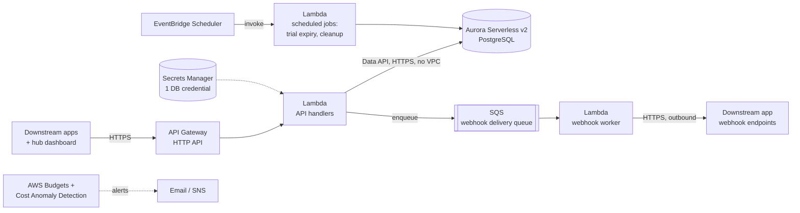

# Deployment Architecture
{: .no_toc }

Where the platform API actually runs. This supersedes an earlier Vercel-based deployment plan — the target is now AWS, chosen and configured around one constraint above all others: **predictable, capped cost, with no surprises.**
{: .fs-6 .fw-300 }

1. TOC
{: toc }

---

{: .note }
Scope: this page is about the **platform API** specified throughout this site — not the documentation site itself, which already runs on GitHub Pages at no cost and isn't changing.

## Cost principles

Four rules this architecture is built around, in priority order:

1. **No resource bills by the hour regardless of traffic.** No always-on EC2 instance, no Fargate task, no NAT Gateway. If nobody's calling the API, the API costs close to nothing.
2. **Every component with a cost has a known floor and a known ceiling.** "Serverless" isn't automatically cheaper — some AWS serverless products (Aurora Serverless v2's minimum capacity, for one) have a *higher* floor than the plain fixed-price alternative, and that trade is only worth it when something else about the product earns it back. See [Database engine: AWS options compared](#database-engine-aws-options-compared) for the actual comparison rather than assuming either answer.
3. **A hard budget alarm exists before the first resource does.** Guardrails are step one of the build checklist below, not a follow-up task.
4. **Scale-out is a later, deliberate decision, not a default.** Nothing in Tier 0 auto-scales into real money without a human decision — see [Scale-out](#scale-out) for what actually triggers each upgrade.

## First deployment (Tier 0)

| Component | Service | Why this one |
|---|---|---|
| API compute | **Lambda** behind **API Gateway (HTTP API)** | Pay-per-request, zero idle cost. HTTP API over REST API — materially cheaper per request for the same job. |
| Database | **Aurora Serverless v2 (PostgreSQL)**, accessed via the **RDS Data API** | The domain model is relational (joins, foreign keys, the Audit log) — Postgres fits it directly. Data API means Lambda calls the database over signed HTTPS with **no VPC attachment** — which is what avoids a NAT Gateway entirely (see below), not a minor detail. |
| Webhook delivery | **SQS** queue + a dedicated worker **Lambda** | Matches the retry/backoff schedule in [Webhooks](../api-reference/webhooks/) — SQS visibility timeouts drive the delay between attempts for free, no extra scheduler needed for that part. |
| Scheduled jobs | **EventBridge Scheduler** → **Lambda** | Trial-expiry checks, idempotency-key cleanup — pay-per-invocation, no cron server to run. |
| Secrets | **Secrets Manager** — one secret, the Aurora master credential | The one secret Data API auth requires. Everything else non-secret goes in Lambda environment variables rather than paying per-secret for config that isn't sensitive. |
| DNS / TLS | **Route 53** + **ACM** (free) + API Gateway custom domain | Backs the `api.substratalapps.com` base URL from [Conventions](../api-reference/conventions/#base-url). |
| Static assets (avatars, etc.) | **S3** + **CloudFront** | Pay-per-use; negligible at Tier 0 volume. |
| Logs | **CloudWatch Logs**, retention capped at 30 days | Explicit retention is the fix for the single most common "why is my CloudWatch bill growing every month" surprise — logs left at *never expire* by default. |
| Cost guardrail | **AWS Budgets** (two thresholds) + **Cost Anomaly Detection** | See [Cost guardrails](#cost-guardrails) — this exists before the first Lambda does. |

### Database engine: AWS options compared

Postgres is the storage engine — resolved in [Decisions → Storage primitive scope](../decisions/#8-storage-primitive-scope): the domain model is relational, and [Database Schema](../domain-model/database-schema/) depends on real foreign keys, `check` constraints, and Row-Level Security that a document store doesn't give for free. The open question was *which* AWS Postgres product, evaluated specifically for the lowest predictable starting price:

| Option | Starting price | Trade-off |
|---|---|---|
| **RDS for PostgreSQL**, single-AZ `db.t4g.micro` | ~$12–13/month, storage separate — the cheapest *fixed* number AWS offers | No Data API — Lambda needs a direct Postgres connection, which means VPC attachment, which reopens the NAT question this page spent a whole section avoiding. Also no multi-cluster story: every [Tenancy](../domain-model/tenancy/) tier would need its own bespoke connection-routing code, not just a lookup-table value. |
| **Aurora Provisioned (PostgreSQL-compatible)**, smallest instance | ~$55–60/month single-AZ — Aurora's smallest instance class is larger than RDS's smallest | Pricier than Serverless v2's floor for a low-traffic start, with none of Serverless v2's scale-with-load benefit. Not competitive against either other option at Tier 0 volume. |
| **Aurora Serverless v2 (PostgreSQL-compatible)**, 0.5 ACU minimum — **chosen** | ~$43/month floor, scales up with load | Costs more than bare RDS at idle. What it buys back: the **Data API**, which is why Tier 0 has no VPC at all (see [below](#why-no-vpc-and-specifically-no-nat-gateway)), and why [Tenancy tiers](#tenancy-tiers--where-they-run) can route a request to any of several clusters — shared, or a specific customer's `isolated`/`dedicated_region` one — via one lookup-table value, with every tier using the identical connection mechanism. |

**The ~$30/month gap between RDS and Aurora Serverless v2 is a real, named cost** — not hand-waved away — paid specifically for not having to build and maintain two different database-connection code paths (one VPC-bound for a cheap shared tier, one Data-API-based for dedicated tenants) or a NAT Gateway. At Tier 0's actual scale (see [Growth trajectory](#growth-trajectory)) that $30/month is a smaller cost than the engineering time either alternative would take to build and keep correct. Revisit this specific trade if [Scale-out](#scale-out)'s connection-count trigger ever makes Aurora's own overhead the bigger line item.

### Why no VPC, and specifically no NAT Gateway

A NAT Gateway (~$32/month plus per-GB data processing, easy to forget it's running) is the single most common unexpected line item in a small AWS bill, and it's usually there because *something* in a VPC needed outbound internet access. This architecture avoids needing one at all:

- The API Lambda talks to Aurora via the **Data API** (HTTPS, IAM-signed) instead of a direct Postgres connection — so it never needs to be placed inside the VPC in the first place.
- The webhook-delivery worker needs genuine outbound internet access (POSTing to arbitrary downstream URLs per [Webhooks](../api-reference/webhooks/)) — it gets that for free by **not** being placed in a VPC either; a Lambda outside a VPC has normal internet access by default, at no extra cost.

Net effect: zero VPC, zero NAT, for the entire Tier 0 stack. This is revisited in [Scale-out](#scale-out) once throughput, not cost, becomes the binding constraint.

## Cost guardrails

Set up in this order, before any other resource:

1. **AWS Budgets** — two budgets on the account (or a dedicated cost-allocation tag if this account hosts more than this one system):
   - **Warn** budget: alerts at 50% / 80% / 100% of a modest monthly threshold (e.g. $75) — sized just above the known Tier 0 floor below, so it fires on real anomalies, not routine operation.
   - **Hard** budget: a [Budget Action](https://docs.aws.amazon.com/cost-management/latest/userguide/budgets-controls.html) at a second, higher threshold (e.g. $150) that automatically attaches a restrictive IAM policy to non-essential roles — a real circuit breaker, not just another email.
2. **AWS Cost Anomaly Detection** (free) — catches a spend spike from, say, a retry-loop bug days before a monthly Budget threshold would, specifically because it's pattern-based rather than threshold-based.
3. **CloudWatch billing alarm** as a third, independent tripwire (belt-and-suspenders — Budgets and Cost Anomaly Detection are the primary tools, but a single CloudWatch alarm on `EstimatedCharges` costs nothing and doesn't depend on either of them working correctly).

### Illustrative Tier 0 floor cost

Rough, region-dependent, **not a quote** — the point is that every line is a known number, not a surprise:

| Item | Approx. monthly floor |
|---|---|
| Aurora Serverless v2, 0.5 ACU minimum, running continuously | ~$43 |
| Aurora storage (low volume) | ~$1–5 |
| Secrets Manager (1 secret) | ~$0.40 |
| Route 53 hosted zone | ~$0.50 |
| Lambda + API Gateway + SQS + EventBridge at low traffic | Low single digits — much of this is covered by the AWS free tier for the first 12 months |
| S3 + CloudFront at low volume | Near $0 |
| **Floor total** | **~$45–55/month**, before any real traffic |

The Aurora minimum is the floor's dominant term and the one genuine fixed cost in this design — accepted deliberately as a known number in exchange for a real relational database, rather than chasing a theoretical $0 floor with a data model that doesn't fit the access-control domain.

## Growth trajectory

The stated plan: dozens of users and a handful of Applications in the first 6-12 months, roughly 10x from there over the following 6-12 months, and another 10x (100x from today) beyond that. Mapped against Tier 0 and the triggers below:

| Horizon | Rough scale | What this means for the architecture |
|---|---|---|
| 0–6/12 months | Dozens of users, a few Applications | **Tier 0 as specified, unchanged.** The floor cost table above is sized for exactly this — nothing here should need touching. |
| 6–12 months out (~10x) | Low hundreds of users | Watch [Rate limiting](../non-functional-requirements/#rate-limiting) defaults and the Aurora ACU ceiling (not just the floor) — this is when the *first* [Scale-out](#scale-out) triggers are plausible (read load, cold-start latency), not when they're guaranteed. Check the table below against real metrics rather than upgrading preemptively. |
| 12+ months (~100x) | Low thousands of users | This is the horizon [Scale-out](#scale-out)'s read-replica, Provisioned Concurrency, and RDS Proxy rows are realistically aimed at. Also the point multi-tenancy load (more Organizations, more concurrent Applications) makes the [Multi-tenancy](../non-functional-requirements/#multi-tenancy) RLS policies' query performance worth profiling specifically, not just trusting by design. |

The point of naming these horizons isn't to pre-build for them — per [Cost principles](#cost-principles), scale-out stays a deliberate, triggered decision — it's so "is it time yet" has a concrete number to check against instead of being a guess.

## Tenancy tiers & where they run

[Tenancy](../domain-model/tenancy/) is a second, independent scale-out axis from [Growth trajectory](#growth-trajectory) above — it's triggered by one customer's requirement, not by aggregate volume, and can happen on day one for a single large customer well before the traffic-driven triggers below are anywhere close. See [Decisions → Tenancy tiers & dedicated infrastructure](../decisions/#12-tenancy-tiers--dedicated-infrastructure) for how the three tiers and the support-gated process were decided.

| Tier | Infrastructure | Relationship to Tier 0 above |
|---|---|---|
| `shared` | Exactly [Tier 0](#first-deployment-tier-0) as specified — the same Aurora cluster every other `shared`-tier Tenant uses, isolated by the `tenant_id` Row-Level Security policy from [Non-Functional Requirements → Multi-tenancy](../non-functional-requirements/#multi-tenancy). | Is Tier 0. No separate infrastructure exists for this tier. |
| `isolated` | A second (third, fourth, …) Aurora Serverless v2 cluster, its own Secrets Manager secret, same AWS account and region as Tier 0. The API Lambda's Data API calls are routed to the right cluster via a small `tenants` lookup table (see [Database Schema](../domain-model/database-schema/#tenants)) kept in the primary/shared cluster — no new Lambda functions, no code fork. | One extra Aurora floor (~$45–55/month, see [the table above](#illustrative-tier-0-floor-cost)) per `isolated` Tenant. Priced as a paid add-on for exactly that reason. |
| `dedicated_region` | Like `isolated`, but the dedicated cluster — and, if latency to that region matters, a regional API Gateway + Lambda deployment in front of it — sits in the customer's chosen AWS region. | The `isolated` floor again, in a second region. The most expensive tier, reserved for a genuine data-residency requirement. |

### Migration mechanics

A tier change (`shared → isolated`, or either `→ dedicated_region`) is support-run, during a brief scheduled maintenance window — see [Decisions → Tenancy tiers](../decisions/#12-tenancy-tiers--dedicated-infrastructure) for why a short announced downtime, rather than zero-downtime logical replication, is the right first implementation:

1. Provision the destination cluster (new Aurora Serverless v2 cluster; for `dedicated_region`, in the target region) via the same [Build checklist](#build-checklist) steps used for Tier 0 itself.
2. Set the source Tenant's `status` to `migrating` — the API layer treats this as read-only for that Tenant's rows specifically, not a global outage.
3. Snapshot and restore (RDS snapshot copy, or `pg_dump`/`pg_restore` at this data volume) every row carrying that `tenant_id` into the destination cluster.
4. Update the `tenants` lookup row's cluster endpoint, flip `tier`/`region`/`status` back to `active`, decommission the old rows once the cutover is confirmed.
5. Record an [Audit Event](../domain-model/orders-and-audit/#audit-event) (`tenant.tier_changed`).

Because [Entitlement](../domain-model/entitlements/), [AppProfile](../domain-model/profiles/#appprofile), and [AppSettings](../domain-model/settings/#appsettings) rows all denormalize `tenant_id` (see [Database Schema](../domain-model/database-schema/#conventions-used-below)), step 3 is a `WHERE tenant_id = ...` export per table — no cross-table join needed to find everything that has to move.

## Scale-out

Nothing below is pre-built into Tier 0 — each is a deliberate upgrade, triggered by a specific, named condition, not a default growth path.

| Trigger | Change |
|---|---|
| Sustained read load on `effective-permissions` / catalog reads | Add an Aurora read replica; consider API Gateway response caching for read-heavy, low-churn paths. |
| Lambda cold-start latency becomes user-visible on hot paths | Provisioned Concurrency on the `effective-permissions` and entitlement-toggle handlers specifically — not a blanket setting. |
| Sustained high-throughput DB access, where Data API's per-call overhead starts to matter | Move those paths from Data API to direct VPC connections through **RDS Proxy** — this is the point where a NAT Gateway (or a cheaper NAT instance) becomes worth its cost, because throughput now justifies it rather than convenience. |
| Geographically distributed callers, latency-sensitive | CloudFront in front of API Gateway. |
| [Trust Model](../trust-model/)'s "hub availability is a dependency for every app" becomes a real incident risk, not a theoretical one | Multi-region active-passive — deliberately not a Tier 0/1 concern; premature multi-region is itself a cost and complexity risk. |
| Webhook delivery volume grows enough to need isolation from the main API's blast radius | Split the worker Lambda's concurrency/alerting from the API handlers' (it already runs as a separate function — this is a monitoring/limits change, not a redesign). |
| More than one engineer shipping concurrently | A second AWS account (via AWS Organizations) for staging, separate from production — Tier 0 runs on a single account with a `dev`/`prod` naming convention, which is enough until this trigger. |
| A specific customer requires dedicated or regional infrastructure | Run the [Tenancy tiers](#tenancy-tiers--where-they-run) migration for that one customer's [Tenant](../domain-model/tenancy/) — the one scale-out trigger in this table that's customer-specific rather than aggregate-volume-driven, and can fire at any traffic level. |

## Build checklist

The order this gets stood up in, once API implementation begins:

1. AWS account (or a dedicated member account under Organizations) + billing contact + **Budgets and Cost Anomaly Detection from step 1**, before any other resource.
2. Route 53 hosted zone + ACM certificate for the chosen API domain.
3. Secrets Manager secret for the Aurora master credential; Aurora Serverless v2 cluster with Data API enabled, minimum 0.5 / maximum capacity set deliberately (not left at an unbounded default).
4. IAM: one execution role per Lambda function (API handlers, webhook worker, scheduled-jobs), each scoped to only the Data API, Secrets Manager secret, and SQS/EventBridge resources it actually needs — no shared mega-role.
5. API Gateway HTTP API + custom domain mapping; Lambda handlers deployed behind it, implementing the [API Reference](../api-reference/) / [openapi.yaml](../openapi.yaml) contract.
6. SQS queue + webhook worker Lambda; EventBridge Scheduler rules for trial expiry and idempotency-key cleanup.
7. CloudWatch Logs with explicit retention on every log group; a small set of alarms (error rate, Lambda throttling, Aurora ACU near max) in addition to the billing guardrails from step 1.
8. CI/CD via OIDC federation (GitHub Actions → an AWS deploy role) — no long-lived IAM user access keys committed anywhere.

## Local development

The RDS Data API choice that keeps Tier 0 NAT-free (see [above](#why-no-vpc-and-specifically-no-nat-gateway)) has a real cost: it doesn't have a clean open-source local emulator, so a developer can't just point the production data-access code at "Data API, but local" the way they could with a plain Postgres driver.

The fix is to not let that choice leak into the application code in the first place: put all database access behind a small repository/data-access interface (whatever the implementation language's equivalent of a repository pattern is), with two implementations — one using the Data API (what Lambda runs in every real environment), one using a direct Postgres driver against a local `docker-compose` Postgres (what runs on a laptop and in CI). Business logic, [Access Control](../access-control/) resolution, and request handlers all talk to the interface and never know which implementation is underneath.

This is a small amount of extra structure for a large payoff: it's also exactly the seam [Testing strategy](../non-functional-requirements/#testing-strategy)'s integration tests need to run against a real local Postgres without needing AWS credentials, a VPN, or network access at all to develop and test.

## Open questions this depends on

AWS account structure (new account vs. an existing one, and which region) isn't pinned down yet — see [Decisions](../decisions/#7-aws-account-and-region). Everything above holds regardless of the answer; it only changes where it's stood up.
