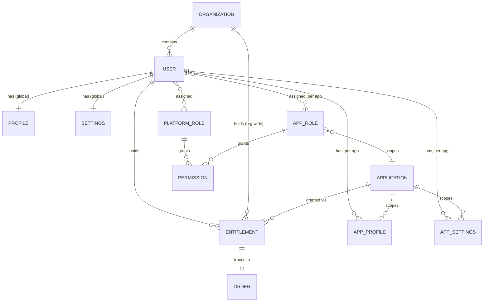

# Domain Model
{: .no_toc }

Nine entities. Most are small on purpose — the complexity in this system is in how they relate, not in any single one's field list.
{: .fs-6 .fw-300 }

## Overview

| Entity | What it represents |
|---|---|
| [User](users-and-organizations/) | A person with an account on Substratal. One identity, used everywhere. |
| [Organization](users-and-organizations/#organization) | A billing/access group of Users. Optional — see [Decisions](../decisions/#2-organizations). |
| [Application](applications/) | A catalog entry for a product Substratal sells. |
| [Role](roles-and-permissions/) / [Permission](roles-and-permissions/#permission) | A named bundle of capabilities, scoped to the platform or to one app. |
| [Entitlement](entitlements/) | The on/off record: does a User own an Application, and is it currently switched on. |
| [Profile](profiles/) / AppProfile | Identity/display data — global, and per-app. |
| [Setting](settings/) / AppSettings | Configuration — global, and per-app, layered over app defaults. |
| [Order](orders-and-audit/) | The commerce record an Entitlement traces back to. |
| [Audit Event](orders-and-audit/#audit-event) | An immutable log of who changed what access, when. |

## How they relate

The relationship worth internalizing before reading further: **Entitlement and Role are independent axes.** Entitlement answers "can this user reach this app at all, right now." Role answers "once inside, what can they do." See [Access Control](../access-control/) for how the two combine on every request.

## ID format

Every entity has an opaque, stable `id`, prefixed by type for readability (a Stripe-style convention): `usr_`, `org_`, `app_`, `role_`, `ent_`, `ord_`, `evt_`, `whk_`. IDs are never reused and never encode meaning beyond the type prefix. See [API Reference → Conventions](../api-reference/conventions/#ids).
