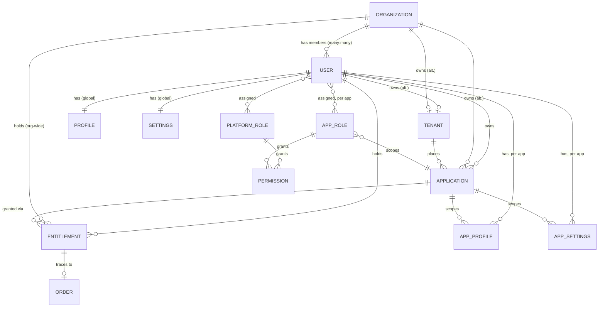

# Domain Model
{: .no_toc }

Ten core nouns, each small on purpose — the complexity in this system is in how they relate, not in any single one's field list — plus four supporting join/credential records that make the many-to-many relationships and multi-method auth actually work without a bigger table.
{: .fs-6 .fw-300 }

## Overview

| Entity | What it represents |
|---|---|
| [User](users-and-organizations/) | A person with an account on Substratal. One identity, used everywhere. |
| [Organization](users-and-organizations/#organization) | A domain/grouping object — a company, or a group within one — for Users. Decoupled from infrastructure placement; see [Tenancy](tenancy/). Pulled into [Phase 2](../roadmap/#phase-2). |
| [Tenant](tenancy/) | The infrastructure-placement and data-isolation boundary for one Application owner's data — shared, isolated, or dedicated-region. See [Tenant vs. Organization](tenancy/#tenant-vs-organization). |
| [Application](applications/) | A catalog entry for a developer's app, built on this platform for its user/org/tenancy/settings/storage layer. |
| [Role](roles-and-permissions/) / [Permission](roles-and-permissions/#permission) | A named bundle of capabilities, scoped to the platform or to one app. |
| [Entitlement](entitlements/) | The on/off record: does a User own an Application, and is it currently switched on. |
| [Profile](profiles/) / AppProfile | Identity/display data — global, and per-app. |
| [Setting](settings/) / AppSettings | Configuration — global, and per-app, layered over app defaults. |
| [Order](orders-and-audit/#order) | *Not stored here.* The developer's own commerce record. An Entitlement carries only an opaque `order_id` reference to it. |
| [Audit Event](orders-and-audit/#audit-event) | An immutable log of who changed what access, when. |

## Supporting entities

Each of these is a join or credential record behind one of the relationships above — real rows in the schema, just not independent *concepts* the way the ten above are:

| Entity | Joins | What it represents |
|---|---|---|
| [UserIdentity](users-and-organizations/#useridentity) | User ↔ login method | How a User actually authenticates — `password` or `sso` — since a User can hold more than one at once. See [Auth → Native auth and per-Organization SSO](../api-reference/auth/#native-auth-and-per-organization-sso). |
| [SSOConnection](users-and-organizations/#ssoconnection) | Organization ↔ identity provider | One Organization's federated-login configuration, referenced by its members' `sso`-method UserIdentity rows. |
| [OrganizationMembership](users-and-organizations/#organizationmembership) | User ↔ Organization | Which Organizations a User belongs to, and their standing (`org_admin`/`member`) in each. |
| [UserRoleAssignment](roles-and-permissions/#userroleassignment) | User ↔ Role | Which Roles a User holds, platform-wide or scoped to one Application. |
| [Session](users-and-organizations/#session) | User ↔ login | One successful login. Every refresh token and app token minted from it carries its id (`sid`), so revoking it ends them all. |
| [TierChangeRequest](../api-reference/tenancy/#post-v1tenantsidtier-change-requests) | Tenant ↔ migration | One support-run request to move a Tenant to a more isolated tier. |
| [Webhook subscription](../api-reference/webhooks/) | Application ↔ endpoint | Where an Application's events are delivered, plus the delivery log. |

## How they relate

The relationship worth internalizing before reading further: **Entitlement and Role are independent axes.** Entitlement answers "can this user reach this app at all, right now." Role answers "once inside, what can they do." See [Access Control](../access-control/) for how the two combine on every request.

## ID format

Every entity has an opaque, stable `id`, prefixed by type for readability (a Stripe-style convention): `usr_`, `uid_`, `ssc_`, `ses_`, `org_`, `tnt_`, `tcr_`, `app_`, `role_`, `ent_`, `evt_`, `whk_`, `wev_`, `dlv_`, `key_`. IDs are never reused and never encode meaning beyond the type prefix (Role is a deliberate exception — see [Conventions](../api-reference/conventions/#ids)).

Building the actual database, not just calling the API? [Database Schema](database-schema/) has the Postgres-level types, constraints, and indexes behind every entity above.
