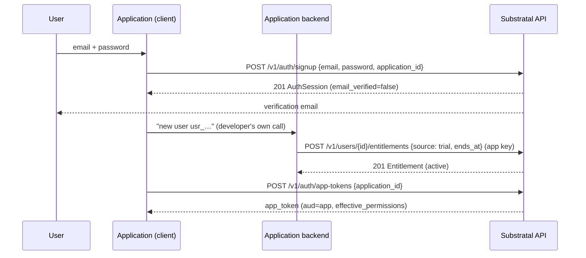
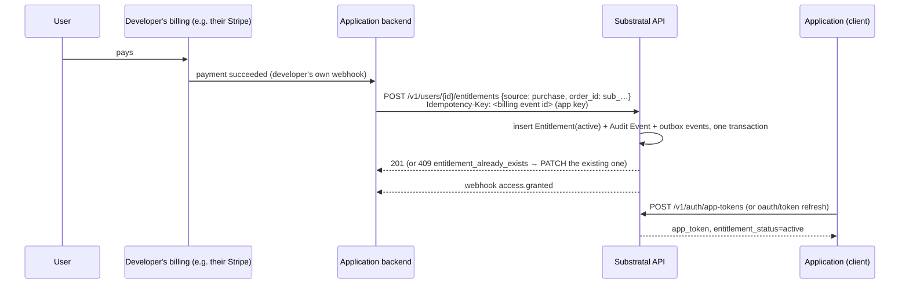

# Workflows
{: .no_toc }

End-to-end sequences across the resources in the [API Reference](../api-reference/). If you're adding a feature, check here first. It's probably a step inside one of these, not a new flow.
{: .fs-6 .fw-300 }

1. TOC
{: toc }

---

## End user signs up inside an app (embedded login)

The common first-contact path: someone downloads a developer's app and creates an account from inside it.



1. The app calls [`POST /v1/auth/signup`](../api-reference/auth/#post-v1authsignup). The User, Profile, Settings, and `member` Role are created in one transaction, and the app gets a session immediately.
2. Signup grants nothing. **The developer decides** whether this user gets the app: free tier, trial, or nothing until they pay. Their backend grants an [Entitlement](../api-reference/entitlements/#post-v1usersidentitlements) with its app-scoped [API Key](../api-reference/api-keys/#app-confined-permissions).
3. The app exchanges the platform session for an [app token](../api-reference/auth/#post-v1authapp-tokens) and verifies it locally from then on. The user's [AppProfile](../api-reference/profiles/) and [AppSettings](../api-reference/settings/) read as defaults until the app first writes them.

## Purchase → access

Someone pays the *developer* for their app. Substratal never sees the payment; the developer's backend reflects the outcome.



1. The developer's own billing system (see [Orders & Audit → Billing system of record](../domain-model/orders-and-audit/#billing-system-of-record)) tells the developer's backend that a payment succeeded.
2. The backend calls `POST /v1/users/{id}/entitlements` with `source: purchase`, its own subscription id as `order_id`, and its billing event id as the `Idempotency-Key`. A retried billing event can never double-grant.
   - If the user already holds a `trial`, the backend `PATCH`es it instead: `{"source": "purchase", "order_id": "sub_…", "ends_at": null}`.
   - If the user holds a `disabled` row, the backend sets it back to `active`.
3. The Entitlement, its Audit Event, and its webhook events commit together. `entitlement.granted` and `access.granted` go to the app's subscriptions.
4. The next app token or introspection call reflects `active`.

**Reverse direction:** a refund or a lapsed subscription on the developer's side becomes `PATCH /v1/entitlements/{id}` `{"status": "revoked", "disabled_reason": "refunded"}`. A lapse at period end can also be modeled up front by setting `ends_at`, in which case the hub expires it automatically. Find the row with `GET /v1/entitlements?order_id=sub_…`.

## Admin turns an app off for a user

The "kill switch": a support agent or admin disabling one user's access to one app, without touching anything else about their account.

1. `PATCH /v1/entitlements/{id}` with `{"status": "disabled", "disabled_reason": "..."}`, ideally with `If-Match`.
2. In one transaction, the hub writes an [Audit Event](../domain-model/orders-and-audit/) (`entitlement.disabled`, with actor, before/after, and reason) and enqueues webhook events.
3. The hub emits `entitlement.disabled` and, if this was the user's only active path to the app, `access.revoked` (reason `entitlement_disabled`).
4. The app, subscribed to `access.revoked` as it's [required to be](../trust-model/#how-fast-does-revocation-need-to-land), force-expires the user's local session immediately. The app token's 5-minute TTL is only the backstop.
5. Nothing about the user's Role assignments, Profile, or Settings for that app changes. Re-enabling (`{"status": "active"}`) restores exactly what was there before, and fires `access.granted`.

## User is suspended

1. `POST /v1/users/{id}/suspend` (`users.manage`).
2. Every hub session is revoked. Platform tokens stop working on their next request, and refresh fails.
3. `access.revoked` (reason `user_suspended`) fires for **every** Application the user had active access to, and `user.suspended` fires to subscribers.
4. Entitlements are untouched. `PATCH {"status": "active"}` reactivates the user and fires `access.granted` for each app they still have.

## Role change

1. An admin, the app's owner, or the app's own key calls `POST /v1/users/{id}/roles/{roleId}` (assign) or `DELETE` (remove).
2. `effective_permissions` for that user and that app changes immediately on the hub side.
3. The hub emits `role.assigned` / `role.removed`.
4. Downstream, an assignment is picked up at the next app token (at most 5 minutes) or introspection call. A **removal** must take effect immediately: `role.removed` is part of the required subscription set, and the app should drop the permission from the live session as soon as it arrives.

## New user, first app

1. An admin provisions the user: `POST /v1/users` creates the account (`invited` by default). A default Profile and Settings are created, the `member` platform Role is assigned, and an invitation email is sent.
2. An admin or the developer's backend grants an Entitlement (`admin_grant`, `trial`, or `purchase`). This is allowed while the user is still `invited`, and access starts once they activate.
3. The user accepts the invitation ([`POST /v1/auth/invitations/accept`](../api-reference/auth/#post-v1authinvitationsaccept)), setting a password, and is signed in.
4. The first time the app reads the user's AppProfile or AppSettings, it gets defaults. The first write creates the row. There's no "provision this user in this app" step to orchestrate.

## Team purchase (org-wide grant)

1. A customer creates an [Organization](../api-reference/organizations/#post-v1organizations) (self-service) and invites members.
2. The customer pays the developer for a team plan. The developer's backend calls `POST /v1/organizations/{id}/entitlements` with its app key: `order_id`, and optionally `member_scope`.
3. Every included member gets access. `access.granted` fires once per member. New members added later are included automatically under `all_members`/`denylist`.
4. Seat changes on the customer's side need no API call unless the developer limits seats with `member_scope: allowlist`. Billing per member is the developer's business; each included member counts as one *Substratal* seat for the developer's own plan (see [Pricing](../pricing/#what-seat-means-here)).

## An org admin narrows who an org-wide grant reaches

1. An org admin (`OrganizationMembership.role: org_admin`) calls `PATCH /v1/entitlements/{id}` on their Organization's `org_seat` Entitlement, setting `member_scope: allowlist` or `denylist` and `member_overrides`.
2. The hub writes an [Audit Event](../domain-model/orders-and-audit/#audit-event) (`entitlement.member_scope_changed`). It's not `entitlement.disabled`/`entitlement.granted`, since the grant's own `status` didn't change.
3. Every affected member's resolved access is recomputed. Nothing is backfilled, because there's no per-member row to update. `access.revoked` (reason `org_grant_changed`) fires for each member who lost their only path, and `access.granted` for each who gained one. A member excluded this way keeps any separate, personally-sourced Entitlement to the same app. See [Access Control → Organization vs. User precedence](../access-control/#organization-vs-user-precedence).

## Developer upgrades their own plan (Starter → Team)

1. The Application owner calls [`POST /v1/tenants/{id}/billing/checkout-sessions`](../api-reference/billing/#post-v1tenantsidbillingcheckout-sessions) with `plan: team` and is sent to Stripe Checkout.
2. They pay. Stripe sends `checkout.session.completed` and `customer.subscription.created` to the hub's Stripe webhook.
3. The hub sets `plan: team` and `subscription_status: active` on the Tenant and writes `tenant.plan_changed`. Limits rise immediately.
4. The owner's client polls `GET /v1/tenants/{id}/subscription` until `plan` is `team`.

## A customer needs dedicated or regional infrastructure

Support-run today. See [Tenancy → How a tier change happens today](../domain-model/tenancy/#how-a-tier-change-happens-today) for why this isn't self-service yet.

1. A customer (an Application owner on the Enterprise plan) asks support for dedicated infrastructure, or a specific region for data residency.
2. Support calls `POST /v1/tenants/{id}/tier-change-requests`. See [API Reference → Tenancy](../api-reference/tenancy/).
3. Support agrees a window with the customer and `PATCH`es the request to `scheduled`. At the window, it `PATCH`es to `in_progress`, which flips the [Tenant](../domain-model/tenancy/)'s `status` to `migrating` and makes writes return `503` with `Retry-After`. Then it runs the snapshot/restore cutover described in [Deployment Architecture → Tenancy tiers](https://github.com/Adron/substratalapps.com/blob/main/DEPLOYMENT.md). Every [Entitlement](../domain-model/entitlements/), [AppProfile](../domain-model/profiles/#appprofile), [AppSettings](../domain-model/settings/#appsettings), and Audit Event row carrying that `tenant_id` moves to the new infrastructure.
4. `PATCH` to `completed` updates `tier`/`region` and returns `status` to `active`, and an [Audit Event](../domain-model/orders-and-audit/#audit-event) (`tenant.tier_changed`) records it.
5. Nothing about the customer's Applications, Entitlements, or any end user's access changes shape. This workflow only ever moves *where* the same rows live, never *what* they say.

## User asks for their data, then for erasure

1. `GET /v1/users/me/export` returns everything as one JSON bundle.
2. `POST /v1/users/me/erasure-requests` soft-deletes immediately: sessions are revoked, `access.revoked` fires everywhere, and the email address is freed.
3. Seven days later, the [hard-delete cascade](../non-functional-requirements/#hard-delete-cascade) runs and writes `user.erased`.

## Settings resolution, in practice

When an app needs a setting's value for a user (for example, their notification-channel preference), the read order is always:

```
AppSettings override (this user, this app)
  → Settings (this user, global) — reserved keys only: locale, timezone, theme, notifications
    → Application's declared default (the property's JSON Schema `default`)
```

The hub resolves this server-side. `GET /v1/users/{id}/apps/{appId}/settings` returns the fully resolved object, plus where each value came from, so callers never re-implement the fallthrough. See [Domain Model → Settings → Resolution rules](../domain-model/settings/#resolution-rules) for the exact algorithm.
