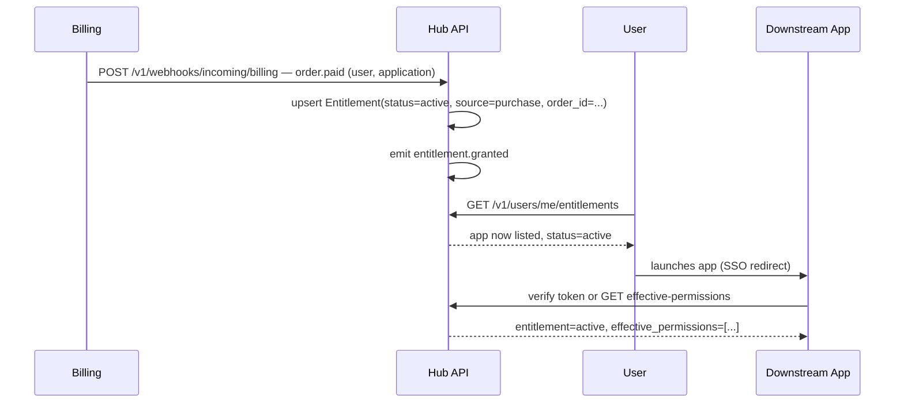

# Workflows
{: .no_toc }

End-to-end sequences across the resources in the [API Reference](../api-reference/). If you're adding a feature, check here first — it's probably a step inside one of these, not a new flow.
{: .fs-6 .fw-300 }

1. TOC
{: toc }

---

## Purchase → access

The most common path: someone buys an app and it shows up, switched on, in their hub.



1. Billing (the system of record for payment, see [Decisions](../decisions/)) completes an order and notifies the hub, either by calling the hub's incoming webhook endpoint or the hub polling billing — whichever direction is chosen, the result is the same write.
2. The hub upserts an `Entitlement` with `status: active`, `source: purchase`, linked to the `order_id`.
3. The hub emits `entitlement.granted` on its own [webhook](../api-reference/webhooks/) system, for any downstream app that wants to react immediately (e.g. pre-provision a workspace) rather than wait for the user to show up.
4. The user's hub dashboard now lists the app as available the next time it calls `GET /v1/users/{id}/entitlements`.
5. The user launches the app. The app verifies the user's standing against the hub — either by decoding the JWT issued at redirect, or calling the live `effective-permissions` endpoint — per the [Trust Model](../trust-model/).

## Admin turns an app off for a user

The "kill switch" flow — a support agent or admin disabling one user's access to one app, without touching anything else about their account.

1. `PATCH /v1/entitlements/{id}` with `{"status": "disabled", "disabled_reason": "..."}`.
2. The hub writes an [Audit Event](../domain-model/orders-and-audit/) capturing the actor, before/after state, and reason.
3. The hub emits `entitlement.revoked`.
4. Any app subscribed to that webhook can invalidate an in-progress session immediately. An app relying only on JWT expiry will honor the change at the next token refresh — see [Trust Model](../trust-model/#how-fast-does-revocation-need-to-land) for the tradeoff.
5. Nothing about the user's Role assignments, Profile, or Settings for that app changes — re-enabling the entitlement restores exactly what was there before.

## Role change

1. An admin calls `POST /v1/users/{id}/roles/{roleId}` (assign) or `DELETE` (remove) — platform-scoped or app-scoped.
2. `effective_permissions` for that user (and, if app-scoped, that app) changes immediately on the hub side.
3. The hub emits `role.assigned` / `role.removed`.
4. Downstream, this is picked up the next time the app checks — introspection call or next token refresh — not necessarily mid-session, unless the app subscribes to the webhook. This is a materially lower-urgency propagation requirement than an entitlement revocation: a user getting slightly stale permissions for a few minutes is a much smaller problem than a de-provisioned user keeping access.

## New user, first app

1. `POST /v1/users` creates the account; a default `Profile` and `Settings` record is created alongside it; the default platform Role (`member`) is assigned.
2. The user acquires an app — either a purchase (see above) or an admin/invite grant (`source: admin_grant` on the Entitlement, no `order_id`).
3. The first time the user opens that app, an `AppProfile` and `AppSettings` record is created lazily, seeded from the Application's declared defaults — there's no separate "provision this user in this app" step to orchestrate; reading or writing either resource for a user who doesn't have one yet creates it with defaults.

## Settings resolution, in practice

When an app needs to know a setting's value for a user (e.g. notification channel preference), the read order is always:

```
AppSettings override (this user, this app)
  → Settings override (this user, global)
    → Application's declared default for that key
```

The hub resolves this server-side — `GET /v1/users/{id}/apps/{appId}/settings` returns the fully-resolved object, not just the override layer, so callers never have to re-implement the fallthrough themselves.
